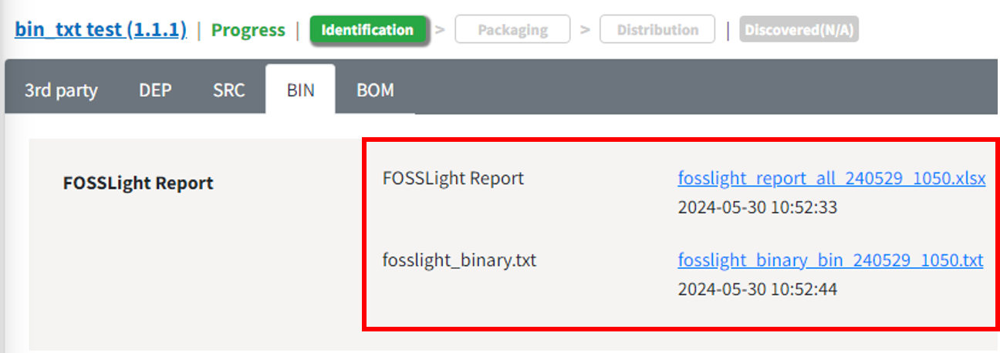
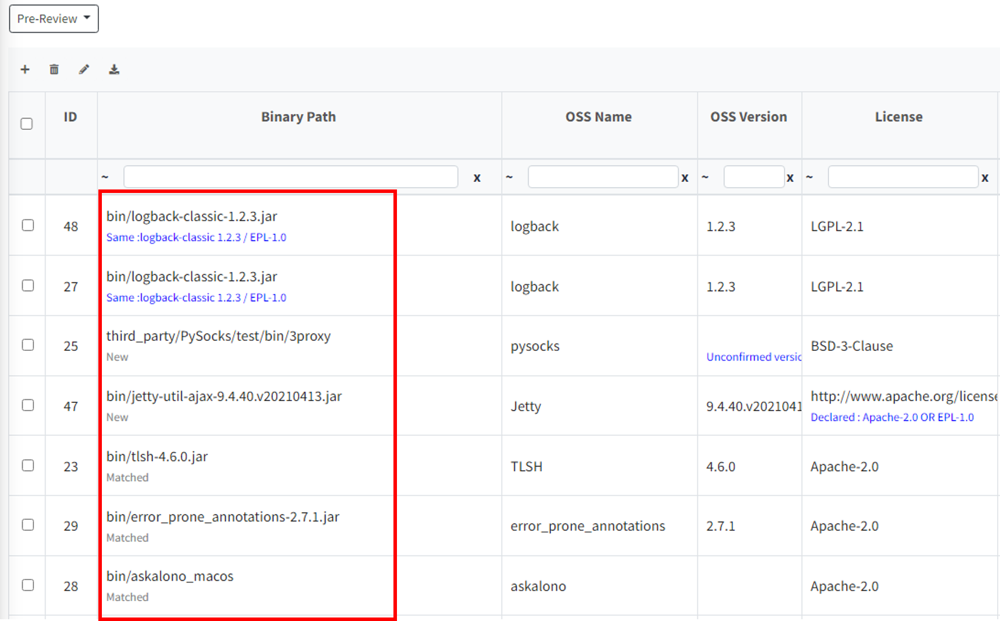

# Binary DB
```note
 이미 분석이 완료된 Base Model의 Binary 정보를 Database화(Binary DB) 하고, 이를 활용하여 파생 Model의 Binary 분석을 자동화할 수 있습니다.
```

## 동작 방식
### Binary 분석 자동화 방법

**Project > Identification > BIN, BIN(Android|Yocto) tab** 또는 **3rd Party SW의 Binary 분석 결과(FOSSLight Report, binary.txt)**를 Upload한 후 Save 버튼 클릭 시, Binary DB와 비교하여 동일 혹은 유사한 Binary의 OSS Name, License 등의 정보를 자동으로 채워줍니다. 
-  binary.txt: checksum, tlsh값을 포함하는 binary 목록


<br>
```note
- [FOSSLight Binary Scanner v4.1.30](https://github.com/fosslight/fosslight_binary_scanner/)이후 버전 사용 시, FOSSLight Report의 Binary Sheet에서 TLSH, Checksum 값 확인 가능. (binary.txt 파일 필요 X)
```

<br>
- Binary Name 하단에서는 Binary DB내의 Binary와 동일(또는 유사)한지 여부에 대한 정보를 Warning message로 보여줍니다.

#### < Warning Message >

| Message | 의미 |
|---------|------|
|<span style="color:#0000FF">Same</span>| Binary DB에 저장된 동일한 binary에 대하여 OSS 정보가 표시되고 일부 정보가 다름을 의미합니다.(ex, License, OSS Name 등)|
|<span style="color:#0000FF">Similar</span>| Binary DB에 저장된 유사한 binary에 대하여 OSS 정보가 표시되고 일부 정보가 다름을 의미합니다.(괄호 안에는 TLSH distance 값이 표시됩니다.)|
|Matched|Binary DB에 저장된 Binary Name, OSS Name, OSS Version, License 가 일치합니다.|
|Modified| 동일한 이름이지만, 유사도가 작은 Binary인 경우입니다.(괄호 안에는 TLSH distance 값이 표시됩니다.)|
|New|Binary DB에 동일한 이름의 Binary가 없습니다. |


```note
Binary DB내의 Binary와 일치하는지 여부는 다음 두 가지 data를 통해 확인합니다.    
    1. Binary 이름과 checksum 값이 일치하면 동일한 것으로 간주합니다.    
    2. 또는, Binary 이름이 동일하고 두 Binary간의 TLSH distance가 120이하면 유사한 것으로 간주합니다.    
```
