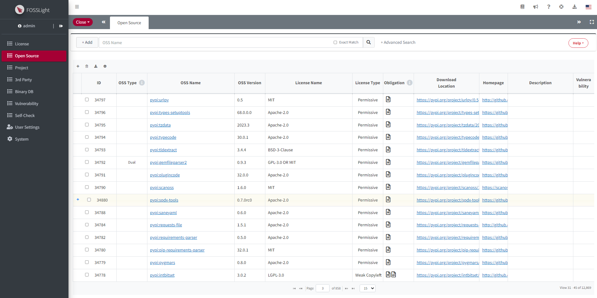
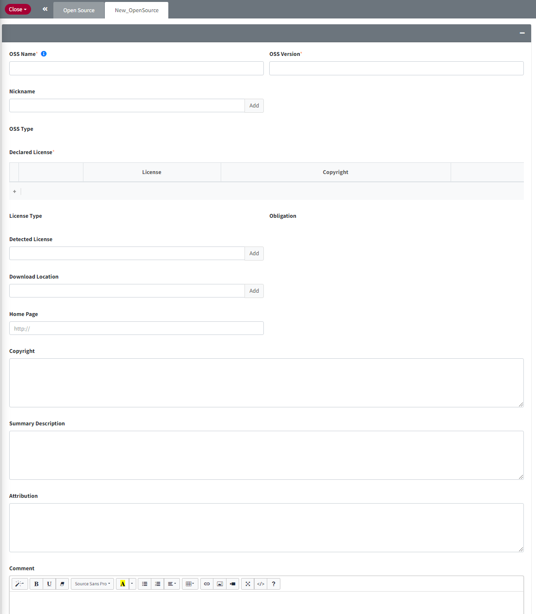

# Open Source
```note
등록된 OSS(Open Source Software) 정보를 확인하고, OSS를 추가, 수정, 삭제할 수 있습니다.     
OSS List의 OSS Name Column 내 cell을 클릭하면 상세정보를 확인할 수 있습니다.    
Deactivate된 Legacy OSS의 경우 회색 Row로 표시됩니다.    
```
## Open Source List


### ID  
- Open Source를 식별하는 숫자입니다.
- Open Source 버전이 여러 개 등록된 경우 '+'가 표시되며 최상위 버전이 표시됩니다. '+' 버튼을 클릭하면 하위 버전의 Open Source 정보를 확인할 수 있습니다.

### OSS Type  
- **Multi**
    - Multi License로 하나의 OSS에 여러 License의 Source Code가 포함된 경우입니다.
    - 실제 사용한 Source Code에 해당하는 License만 OSS 보고서 또는 Identification의 OSS List에 포함하면 됩니다.
        - 예) OSS License : LGPL-2.1 <span style="color:red">AND</span> GPL-2.0 <span style="color:red">AND</span> Zlib <span style="color:red">AND</span> CUPS License Agreement
- **Dual**
    - Dual License로 여러 License 중 하나를 선택할 수 있습니다.
    - 의무 사항이 상대적으로 적은 License를 선택하는 것이 더 좋습니다. (Obligation 참조)
        - 예) OSS License : Apache-2.0 <span style="color:red">OR</span> LGPL-2.1
- **V-Diff**
    - Version different License로 Open Source 버전 별로 License가 다른 경우입니다.

### OSS Name 
- Nick 표시된 OSS는 하나의 OSS가 여러 개의 Name을 갖고 있습니다.
    예) "bison"의 Nick name은 "Bison parser", "GNU bison" 로 모두 같은 OSS를 표현하고 있습니다.
        Identification에서 GNU bison (Nick name)으로 입력된 경우 자동으로 bison (OSS name)으로 변경됩니다.
- 검색 시 자동완성을 지원하며, 세 글자 입력부터 부분 일치하는 OSS Name 목록이 표시됩니다.
      
### Version 
- OSS 버전을 의미합니다.

### License Name 
- OSS의 Declared License 정보를 알 수 있습니다.  
- Multi License는 OSS에 포함되는 모든 License가 <span style="color:red">AND</span>로 표시됩니다.
- Dual License는 OSS의 License를 복수 개 중 선택할 수 있고 <span style="color:red">OR</span>로 표시됩니다.
- 입력 키워드에 License Name 또는 SPDX Identifier 와 일치하는 License 입력 시, 이를 포함하는 모든 Open Source를 검색합니다.

### License Type
- [License Type](https://fosslight.org/hub-guide/menu/2_license.html#license-type)  를 참고하시기 바랍니다. 

### Obligation 
License 별로 고지와 소스코드 공개 의무사항을 알 수 있습니다.
- **Notice Obligation**(:page_facing_up:) : 고지 의무가 있습니다.
- **Source Code Obligation** : 소스코드 공개 의무가 있습니다. 

### Download Location 
- Open Source를 다운로드 받을 수 있는 URL이 Link로 표시되며, 클릭 시 해당 사이트로 이동하거나 파일을 다운로드 받을 수 있습니다.

### Homepage 
- Open Source 공식 Site가 있으면, URL로 표시되며 클릭 시 해당 사이트로 이동합니다.
- URL에 마우스 오버 시 상세주소를 확인할 수 있습니다.

### Description 
- Open Source 사용 시 주의 사항을 확인할 수 있습니다.

### Vulnerability 
- NIST에서 제공하는 NVD DB에서 해당 OSS가 검색되면 취약 정도 (CVE Score)에 따라 Vulnerability 아이콘 색깔로 구분되어 표시됩니다.

## (Admin Only) OSS 추가, 수정, 복사, 삭제, 일괄 변경
### OSS 추가
 
1. OSS List에서 우측 상단 Add 버튼을 클릭합니다.
2. "New_Opensource" 탭에서 신규 OSS의 정보를 입력합니다.
    - OSS Name, Nick Name은 중복될 수 없습니다. 
    - Summary Description : 해당 OSS에 대한 정보를 입력합니다.
    - Attribution : OSS Notice 발행시 별도로 포함되어야 하는 문구를 기입합니다.
3. 우측 하단의 Save 버튼을 클릭합니다.

### OSS 상세정보탭
OSS List에서 OSS Name을 클릭합니다.    
Admin 인 경우에만 Editable하게 표시되며 Save, Sync, Copy, Delete 버튼이 표시됩니다.    
  

#### OSS 수정
- 정보를 수정한 후 우측 상단의 Save 버튼을 클릭합니다.

#### OSS 복사
OSS 복사 기능은 동일한 OSS의 다른 버전을 추가할 때 유용합니다.
1. 우측 하단의 Copy 버튼을 클릭합니다. 
2. 동일한 OSS 정보로 "New_Opensource"탭이 뜹니다.
3. 이때, OSS Version에 "_Copied"가 append 되어 있으므로 버전 정보를 수정해야 합니다.  
4. 정보 수정 후 우측 상단의 Save 버튼을 클릭하면 OSS가 등록됩니다.

#### OSS 삭제
1. Comment란에 삭제 사유를 기입합니다.
2. 우측 상단의 Delete 버튼을 클릭합니다.
    - 📢 해당 OSS가 Identification 단계가 Confirm된 Project에 포함된 경우, Delete 버튼 클릭 시 다른 OSS로 Merge 하는 창이 팝업됩니다.   
    
        - Merge할 OSS를 선택하면, 삭제하는 OSS의 Name과 NickName은 Merge하는 OSS의 Nickname으로 이동됩니다.


#### OSS 버전별 정보 일괄 변경 기능
OSS에 여러 버전이 등록된 경우, 각 버전별 정보를 일괄 업데이트시 사용합니다.
우측 상단의 Sync 버튼을 클릭합니다.
  
- (1) 수정할 OSS 버전을 선택합니다. 
    - 이미 동일한 OSS 정보를 가진 버전의 경우, 회색으로 표시되며 선택 불가합니다.
- (2) 수정할 OSS의 정보를 선택합니다. 
    - 체크된 항목에 대해서만 정보가 업데이트됩니다.
    - 표시되는 정보는 (1)에서 선택된 Row의 해당 버전의 OSS 정보가 표시됩니다.
- (3) Comment 입력란
    - OK 클릭시 (1)에서 선택한 수정할 OSS 버전에 입력한 Comment가 추가됩니다.


