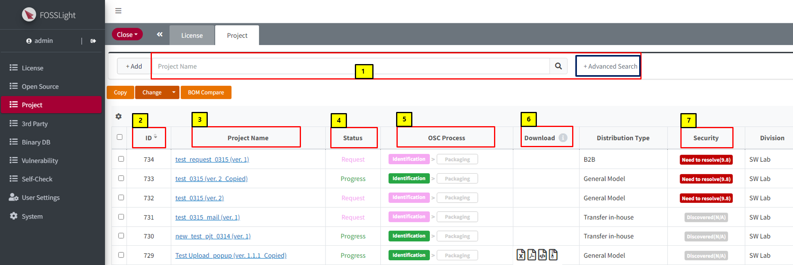
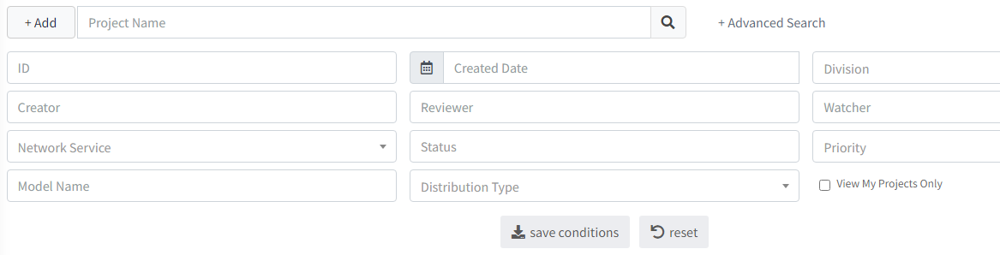
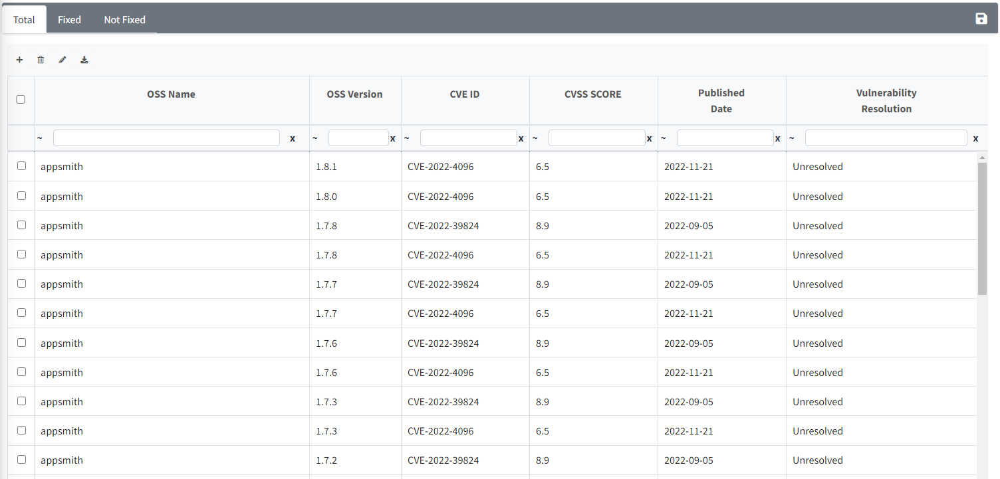
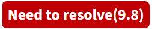
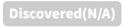
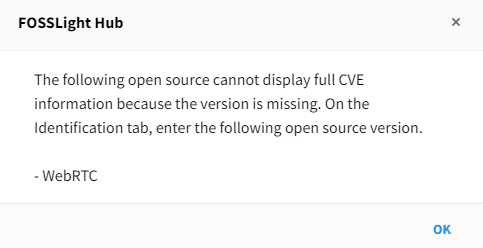
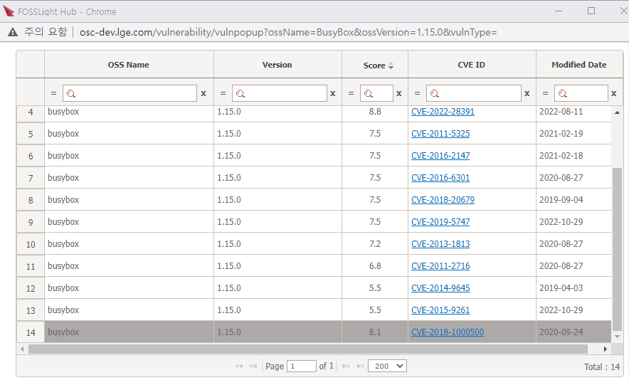

# Project
```note
Open Source Software를 포함하는 Software의 개발 및 배포를 위해 수행해야 하는 Process를 순차적으로 수행합니다.  

```
<iframe width="560" height="315" src="https://www.youtube.com/embed/IUrQyj3s-Ps" title="FOSSLight Hub - 프로젝트 생성" frameborder="0" allow="accelerometer; autoplay; clipboard-write; encrypted-media; gyroscope; picture-in-picture" allowfullscreen></iframe>

## Project List
**Project를 검색하고, 해당 Project의 전체적인 정보를 확인하고 FOSSLight Report, OSS Notice, OSS Package를 다운로드할 수 있습니다.**
  

### 1. Project Search
- Project의 Name으로 검색할 수 있습니다. ***Advanced Search** 기능을 이용하여 다양한 조건으로 검색 가능합니다.
    - Advanced Search
        - ID, Creator, Model Name 등 다양한 조건으로 검색 가능합니다.
    


### 2. Project ID
- 프로젝트를 식별하는 고유 숫자입니다.

### 3. Project Name (Version)
- 더블 클릭하면 Project 상세 화면으로 이동합니다.

### 4. Status
- Project의 상태 정보를 표시합니다.

|Status|   Description   |
|----|----|
|<span style="color:green"> Progress </span>| 사용자가 작성하고 있는 상태입니다.|
|<span style="color:pink"> Request </span>| Identification 또는 Packaging 단계에서 사용자가 Review를 요청한 상태입니다. <br>Self Reject을 통하여 Progress 상태로 변경할 수 있습니다.|
|<span style="color:orange"> Review </span>| Identification 또는 Packaging 단계에서 리뷰어가 Review 중인 상태입니다.<br>사용자는 프로젝트 정보를 수정할 수 없습니다. <br>수정이 필요한 경우, Reviewer에게 [Comment](#comment)를 남겨 Reject 요청해주시기 바랍니다.|
|<span style="color:purple"> Final Review </span>| OSPO 책임자가 최종 리뷰를 진행하고 있는 상태입니다.|
|<span style="color:black"> Complete </span>| Project Review가 완료된 상태를 의미합니다. <br>사용자는 프로젝트 정보를 수정할 수 없습니다.<br> 수정이 필요한 경우 Reviewer에게 Reopen 요청해주시기 바랍니다.|
|<span style="color:grey"> Drop </span>| 더 이상 OSC Process를 진행하지 않는 상태를 의미합니다. <br> Complete가 아닌 경우, Status와 무관하게 사용자가 Drop 설정할 수 있으며, <br>필요시에는 Reopen을 클릭하여 직접 Open할 수 있습니다.|


### 5. OSC Process
- Project의 OSC 프로세스 진행 단계를 나타냅니다.
    - Identification -> Packaging -> Distribution
- Status에 따라 Process의 진행 단계의 색도 달라집니다.


### 6. Download
- (): Identification에서 입력한 목록을 **FOSSLight Report**로 다운로드할 수 있습니다.
- (): Packaging에서 공개할 Source Code가 업로드된 경우 아이콘이 표시되며 **OSS Package 파일**을 다운로드할 수 있습니다.
- (): Packaging 단계가 완료된 경우 아이콘이 표시되며 **OSS Notice**를 다운로드할 수 있습니다.


### 7. Security
```note
Security 탭에서는 Identification 단계의 BOM 탭 기준 Vulnerability score가 기준 점수 이상인 OSS에 대하여 CVE ID별로 확인 및 조치 상태를 관리할 수 있습니다.
- Vulnerability score 기준 점수는 Code Management > 760 (Security Vulnerability Score)에서 설정하실 수 있습니다.
```

- Project의 Identification에 포함된 전체 Open Source List의(Exclude 제외) Vulnerability 정보에 대해 나타냅니다.
    - () : Vulnerability score가 기준 점수 이상인 경우 
    - () : Vulnerability score가 기준 점수 미만인 경우 


#### Column 정보
- **OSS Name, OSS version**
    - Identification 단계의 BOM 탭에 작성된 OSS 정보가 자동 출력됩니다.
- **CVE ID, CVSS Score, Published Date**
    - CVE ID 및 해당 CVE ID의 CVSS Score, 발행일 정보가 자동 출력됩니다. 
- **Vulnerability Resolution**
    - 기본값으로 Unresolved로 설정되며, 보안취약점 해결 시 Fixed로 변경할 수 있습니다. 

#### OSS version 미 입력시
- Security 탭에서는 OSS version 미기입된 CVE ID에 대해 정확한 vulnerability 확인이 어렵기에 전체 CVE ID 리스트를 보여주고 있지 않습니다.
- 탭 진입 시 다음 팝업 화면이 뜨는 경우, Identification 탭에서 해당 Open Source의 정확한 version을 입력한 후 BOM 탭 Save하면 
Security 탭에서 정확한 보안취약점 CVE ID 목록을 확인할 수 있습니다.  


#### Vulnerability Resolution 여부 Identification 단계 반영
- Identification 단계 탭에서 Vulnerability score 확인 시, Security 탭에서 vulnerability resolution 값을 'Fixed'로 변경한 CVE ID에 대해서는 제외된 Max score를 확인할 수 있습니다.
- Identification 단계 탭에서 Vulnerability Icon 클릭 시, 해당 OSS name 및 version에 대한 전체 CVE ID 리스트 창에서 'Fixed'된 CVE ID는 아래와 같이 비활성화 처리된 것을 확인할 수 있습니다.  

<br>
