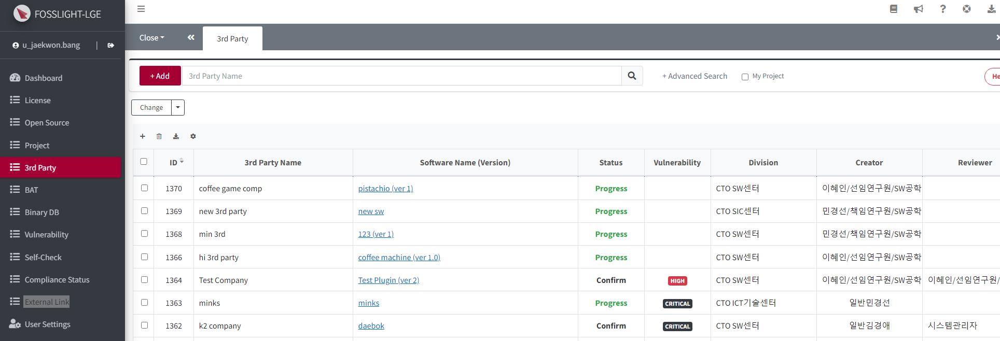
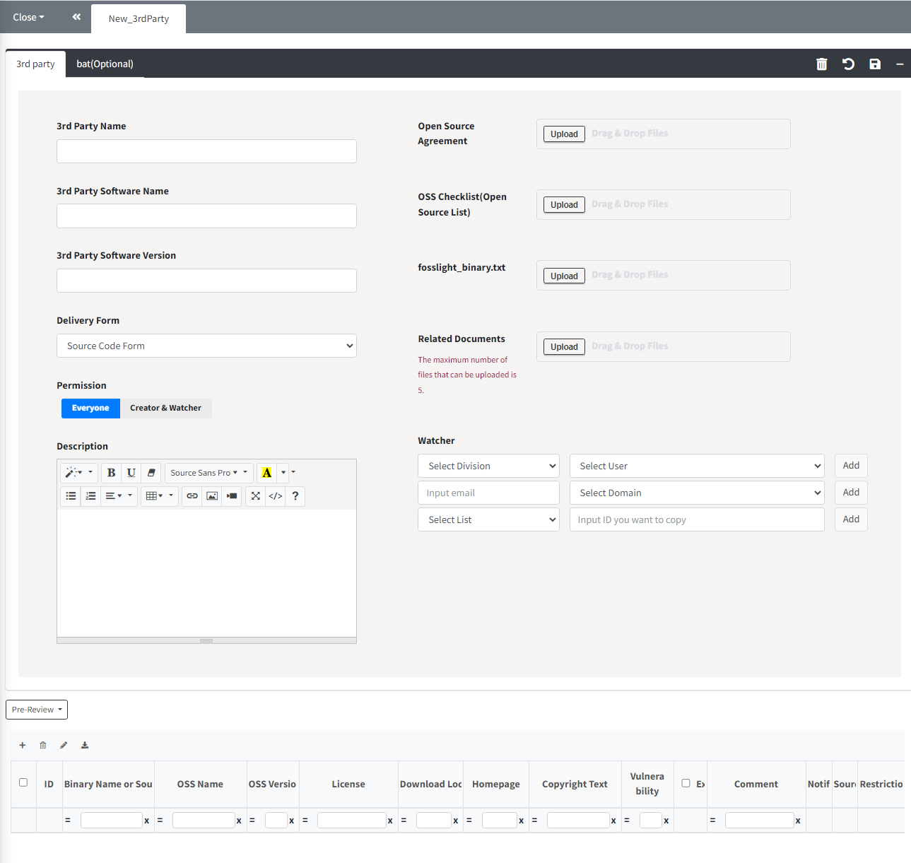
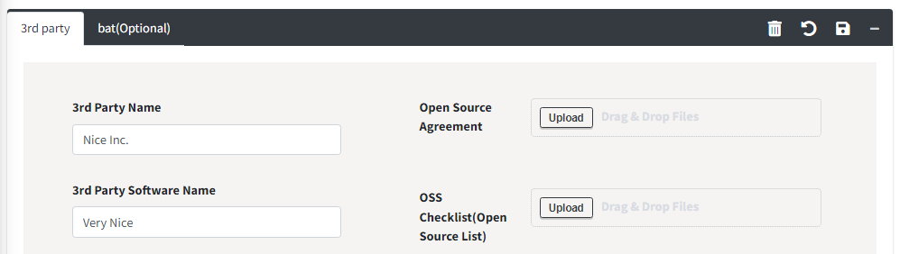
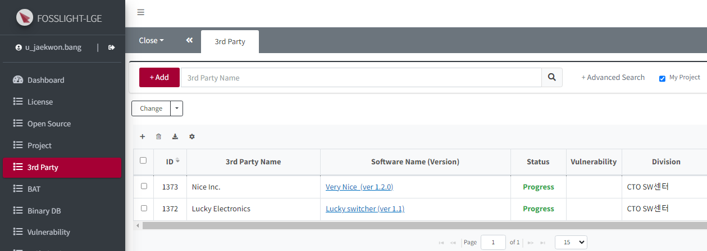
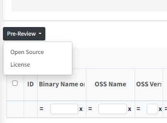
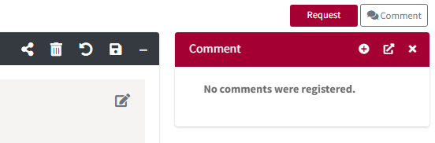

# 3rd Party
```note
- 3rd Party Software를 전달받는 경우, 3rd party에게 3rd Party OSS Checklist 작성 및 제출을 요청하고, 전달 받은 Software의 Open Source 정보를 등록하고 관리합니다.
- Status: Confirm인 3rd Party에 한하여 Project > Identification - 3rd Party 탭에서 Load할 수 있습니다. 
```
<iframe width="560" height="315" src="https://www.youtube.com/embed/U1u1jnQp5Bc" title="YouTube video player" frameborder="0" allow="accelerometer; autoplay; clipboard-write; encrypted-media; gyroscope; picture-in-picture" allowfullscreen></iframe>

## 3rd Party SW 등록 과정
### 1. 사전 준비 사항
- **Open Source Software List**
    - 3rd party로부터 3rd Party OSS Checklist를 요청하여 취합합니다.

### 2. 3rd Party SW 등록

1. 왼쪽 메뉴에서 3rd Party를 클릭합니다.
2. 3rd Party List 왼쪽 상단의 **Add** 버튼을 클릭합니다.
3. 아래와 같이 New_3rdParty 탭에서 3rd Party 정보를 입력하고 Save합니다.  
    
4. 각각의 정보를 입력하고, 준비한 **3rd Party OSS Checklist** 파일을 업로드 합니다.

#### 3rd Party Field 별 Description

|Field| Description |
|:---|:---|
|**3rd Party Name**|3rd Party Name을 기입합니다.|
|**Software Name**|3rd Party로부터 전달받은 Software 명을 기입합니다.|
|**Software Version**|3rd Party로부터 전달받은 Software의 Version을 기입합니다. <br>(하나의 Software에 동일한 version 중복 불가)|
|**Delivery Form**|전달받은 Software의 형태를 선택합니다. (Source Code Form, Binary Form 중 선택)|
|**Permission**| EveryOne : 모든 사용자가 해당 3rd Party SW 정보를 조회할 수 있습니다. <br>Creator/Watcher: Watcher와 Creator 외에는 해당 3rd Party SW를 조회할 수 없게 합니다.|
|**Description**| Open Source Compliance에 필요한 부가 정보가 있을 경우, 기재합니다.|
|**Open Source Agreement**|계약서를 해당 시스템에서 관리하고 싶은 경우에만 첨부합니다.|
|**OSS Checklist (Open Source List)**| 미리 준비한 3rd Party OSS Checklist를 업로드합니다. <br>(업로드 시, apply할 sheet는 'Open Source Software List' 선택.)|
|**fosslight_binary.txt**| Binary 분석 결과로 생성된 fosslight_binary.txt파일을 업로드합니다.|
|**Related Documents**|3rd Party로부터 제공 받은 관련 문서를 업로드 합니다.|
|**Watcher**|해당 3rd Party SW 정보 및 현황을 공유하고자 하는 사용자를 등록합니다.|


### 3. Request
1. 3rd Party SW 정보를 입력 후 상단의 **Save** 버튼()을 클릭합니다.
    
2. Save 후, 해당 SW를 다시 클릭하여 들어갑니다.
    
3. 로드된 OSS에 대해 중간 좌측의 **Pre-Review**를 진행합니다. (Open Source, License 모두)
    
4. 수정된 내용이 있다면 Save 버튼()을 한 번 더 클릭합니다.
5. 우측 상단의 **Request** 버튼을 클릭하여 리뷰를 요청합니다.
    

## 참고
### Create Project for OSS Notice
배포하는 Software가 3rd Party Software로만 구성된다면, Confirm 된 3rd Party List에서 **Project List > Project**(<U>Identification Confirm 상태</U>)를 바로 생성할 수 있습니다.    
단, Identification Confirm 불가인 경우 Identification request 상태의 Project가 생성됩니다.


## (Admin Only) 3rd Party Review
1. 3rd Party List에서 Status : Request인 3rd Party를 더블 클릭합니다. 
2. 우측 상단의 **Review Start**를 클릭합니다. 
    - Status: Review로 변경됩니다. 
3. OSS Table의 빨간색 Warning message에 대하여 검토합니다. 
    - OSS Table에 빨간색 Warning message가 있을 경우, Confirm이 불가합니다. 
    - 신규 OSS로 등록하기 위해서는 해당 Row를 더블 클릭하면 해당 Row의 정보로 기입된 신규 OSS 등록 팝업이 뜹니다. 
4. 확인이 완료되면 Confirm 버튼을 클릭합니다.   
    - 사용자에게 다시 확인 요청할 경우 Reject 버튼을 클릭합니다.
