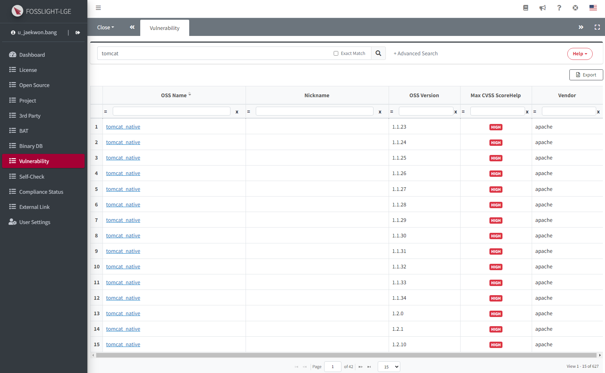
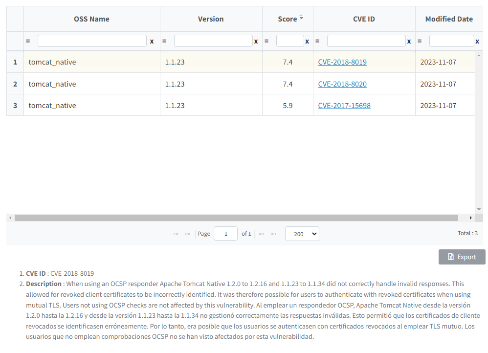
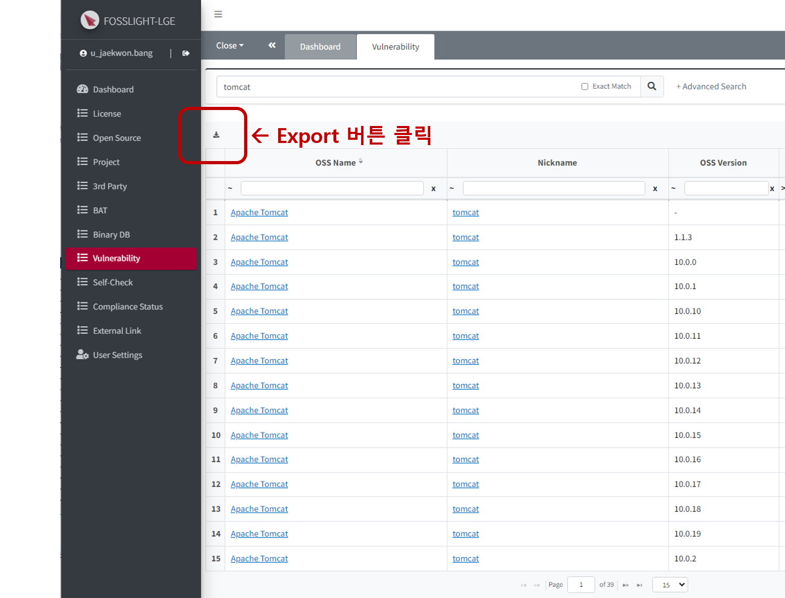
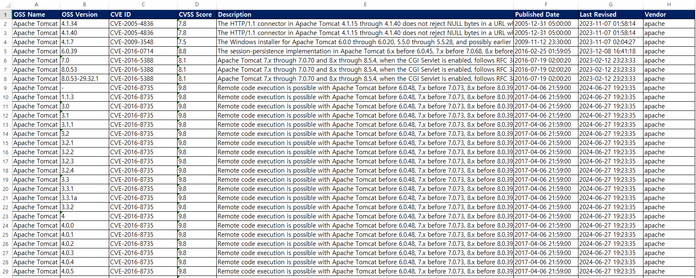

# Vulnerability
```note
Open Source의 보안 취약점 존재 여부 및 관련 정보(CVE ID, CVSS Score)를 확인할 수 있습니다.
```
## Vulnerability List

**[NVD(National Vulnerability Database)](https://nvd.nist.gov/)**의 NVD Data Feeds에서 제공되는 Open Source의 버전별 최고 보안 취약점 정보를 확인 및 검색 할 수 있습니다.  

### 1. 검색 조건   
**OSS Name, OSS Version, CVE ID** 등을 설정하여 검색할 수 있습니다.
- OSS Name과 OSS Version은 OSS List에 등록된 OSS와는 무관하며, NVD Data Feeds Product Name과 Version을 의미합니다.
- Exact match 체크 후 검색시, OSS Name 란의 검색어와 완전 일치되는 결과만 조회합니다.
- CVE ID의 경우, 완전 일치되는 결과만 조회합니다.

### 2. 검색 결과
- **OSS Name 링크 클릭 시** : 해당 Row의 OSS Name, nickname의 해당 버전별 검색된 모든 CVE 결과가 팝업으로 보여집니다.
    - OSS Name, nickname, version에 대하여 완전 일치 검색 결과
    - 단, version: '-'인 경우는 모든 버전 조회
- **Nickname 링크 클릭 시** : nickname으로만 조회되는 해당 버전의 모든 CVE 결과가 팝업으로 보여집니다.
    - Nickname, version에 대한 완전 일치 검색 결과
    - 단, version: '-'인 경우는 모든 버전 조회
- **Max CVSS Score**: OSS의 버전별 가장 높은 Critical Level이 표시 됩니다.

    |Critical Level|Critical Score|
    |:---:|:---:|
    |    Critical    |          9.0 ~ 10.0          |
    |    High    |    7.0 ~ 8.9    |
    |Medium|4.0 ~ 6.9|
    |Low|0.1 ~ 3.9|


## Vulnerability 상세 정보 
### 상세 정보 확인
<!-- - [Project](4_project.md) > Identification 또는 [Self-Check](6_self-check.md)  화면에서 Vulnerability Icon을 클릭합니다. -->
- Vulnerability List에서 검색 후 OSS Name 또는 Nickname의 링크를 클릭합니다.


### Vulnerability 정보 Export
- 사용자가 기입한 OSS에 해당하는 OSS Version과 그 이후 버전들의 버전별 Max Score를 확인할 수 있습니다. 
- Vulnerability link를 클릭하면, 상세 정보 팝업을 확인 가능합니다.
- Vulnerability 정보 조회 후, 왼쪽의 Export 버튼을 클릭하여 엑셀로 다운로드 받을 수 있습니다.


#### Export 정보 확인

- **OSS Name**: OSS Table에 쓰여진 OSS Name
- **OSS Version**: Vulnerability 조회된 version
    - OSS 버전이 공란인 경우, Vulnerability 에 존재하는 모든 버전에 대하여 정보를 출력합니다. 
    - OSS Version이 설정되어 있는 경우 해당 Version의 하위 버전은 CSV 에 포함되지 않습니다. (상위 버전은 모두 포함)
- **CVE ID**: NVD(National vulnerability Database)에서 제공하는 보안 취약점 정보 ID
- **CVSS Score**: 해당 OSS, Version에 대한 Vulnerability **Max Score**
- **Description**: 해당 OSS의 Description 정보
- **Published Date**: NVD에서 해당 보안 취약점을 Publish한 날짜
- **Last Revised**: NVD에서 해당 보안 취약점에 대해 정보를 수정한 날짜
- **Vendor**: OSS Vender(같은 OSS Name일 때, OSS의 Vendor 구분을 위한 항목)
