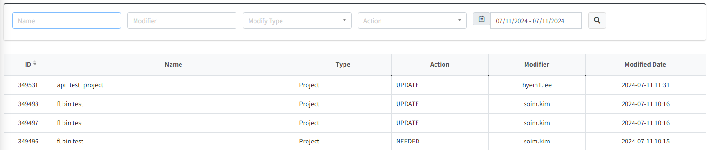
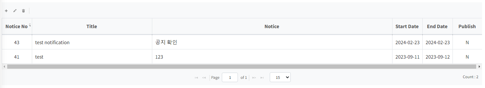
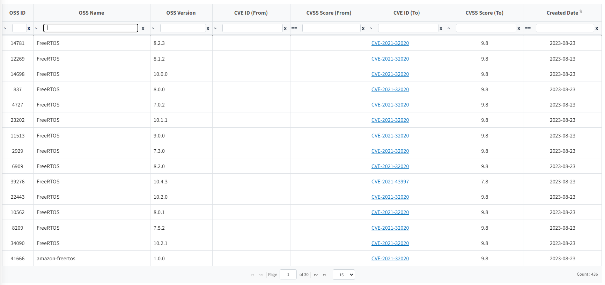

# System
```note
(Admin Only) FOSSLight Hub 운영 Log를 확인하거나 운영 Data를 변경합니다.
```

## Code Management

- 시스템 동작 시 읽을 세팅 값을 설정합니다.

## User Management

등록된 계정 목록을 확인하고 정보를 수정합니다. 
- Create 버튼: [Rest API](../features/2_rest_api.md)에서 사용할 Token을 생성합니다. 
- reset 버튼 : 비밀번호를 ID와 동일하게 초기화합니다. 
- Use YN : 휴면 계정을 설정합니다. 
- Admin : Admin 권한을 부여합니다.

## History List

DB의 Data 변경 사항을 확인합니다. 

## Notification
시스템 접속시 띄울 공지 팝업을 관리합니다.

등록되었던 공지 목록을 확인, 수정합니다. 


List 왼쪽 하단의 + 버튼을 클릭하여 공지를 추가합니다.
- Start Date : 공지 시작일
- End Date : 공지 종료일
- Publish : 체크된 경우, 공지 팝업을 띄웁니다.

## Sent Mail List

메일 발송 내역을 확인합니다.


## Vulnerability Log

Vulnerability Data 변경 사항을 확인합니다.


## Server Setting

### Authentication using LDAP
FOSSLight Hub는 JNDI를 사용하여 Active Directory 등 LDAP을 사용할 수 있는 환경에서는 LDAP을 이용한 사용자 패스워드 인증 처리를 지원합니다.
- Provider Url: LDAP 서버 정보를 ldap://&lt;AD_SERVER_IP&gt;:&lt;LDAP_PORT&gt; 형식으로 설정합니다. (javax.naming.Context.PROVIDER_URL)

### Notice Setting
- Notice Type: 발급 가능한 OSS 고지문 형식을 설정합니다.

### SMTP Setting
- Mail Server: SMTP Host (ex, smtp.gmail.com )
- Email Address: 발송자 이메일 주소(ex, no-reply@fosslight.org )
- Port: SMTP Port 번호 (ex, 25 또는 587)
- Encoding: Default UTF-8 (필요한 경우만 변경)
- Username: SMTP 사용자명 (일반적으로는 발송자 이메일 주소와 동일)
- Password: SMTP 사용자 패스워드 (패스워드는 암호화되어 저장되며, 공백인 경우 기존 패스워드를 변경하지 않습니다.)

### Workspace Path Setting
- Root Path: 업/다운로드 파일 저장소의 최상위 work space 경로
