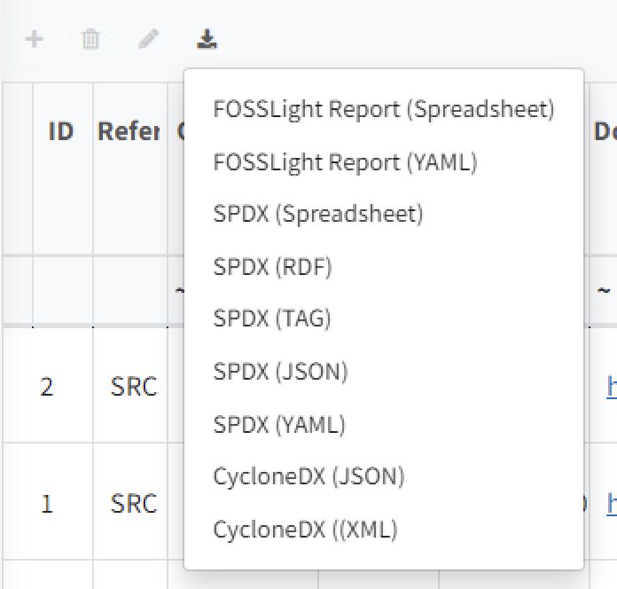
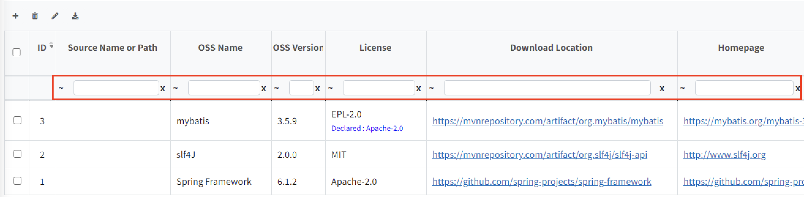
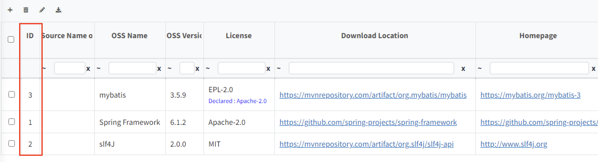
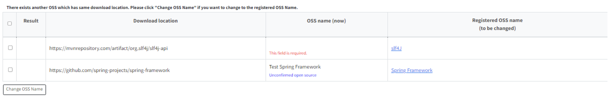
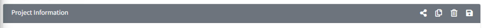
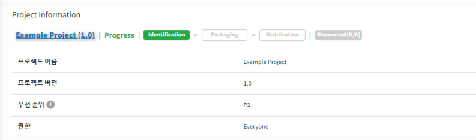
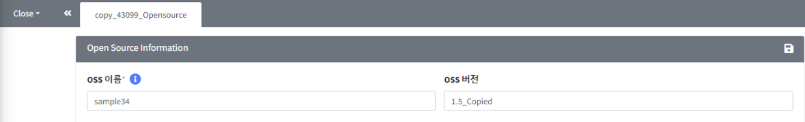
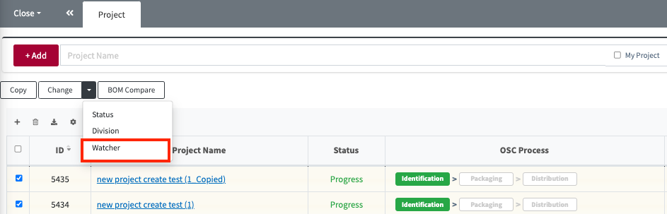

# Common

## OSS Table 활용법
### OSS Table 상단 버튼
OSS Table 우측 상단에는 4가지 버튼이 있습니다.
  
- {: width="1%"} : row가 추가됩니다.
- {: width="1%"} : 선택된 row 삭제됩니다. 선택된 row가 없이 클릭하는 경우, 전체 삭제됩니다.
- {: width="1%"} : Bulk Edit 기능으로, 선택된 row에 전체에 대해 동일한 내용으로 업데이트할 수 있습니다. Bulk Edit 클릭 시 아래와 같은 팝업을 확인할 수 있습니다.
  - 수정을 원하는 항목을 선택한 후, 수정하고자 하는 내용을 작성하고 Change를 눌러줍니다.
    {: width="80%"}
- {: width="1%"} : OSS Table 내용을 선택한 형식으로 Export 합니다.
  - BOM export의 경우 Report 형태 및 SBOM 관리를 위한 여러 형식으로 출력 가능합니다. 
    {: width="30%"}
  - Project에서 다른 BOM을 제외한 다른 탭들의 경우 FOSSLight Report가 출력됩니다. 
    {: width="30%"}
     
### OSS Table Cell 수정
OSS Table에서 수정하고 싶은 내용이 있을 경우, 수정하고자 하는 row를 더블 클릭 하면 입력 가능한 상태로 전환됩니다.

### OSS 정보 자동 완성
시스템에 등록되어 있는 Open Source의 경우, OSS Name과 OSS Version을 통해 저장된 정보를 자동으로 불러올 수 있습니다.
- OSS Name, OSS Version을 입력합니다.
- Version 입력 후, 자동 완성 여부를 묻는 팝업을 확인할 수 있습니다. 팝업에서 OK를 누르면 자동 완성이 됩니다.

### OSS Table Search
Header Column 아래 Filter Row가 위치하고 있습니다. 이 Filter Row를 활용하여 원하는 값을 검색할 수 있습니다.

- Filter Row는 다음과 같이 구성됩니다:
  - 검색조건:

    | **문자**                                             | ~        | ==    | !         | ^          | !^                  | !        | !@                | !~               |
    |----------------------------------------------------|----------|-------|-----------|------------|---------------------|----------|-------------------|------------------|
    | **설명**   &nbsp;&nbsp;&nbsp;&nbsp;&nbsp;&nbsp;&nbsp; | Contains | equal | not equal | begin with | does not begin with | end with | does not end with | does not contain |
  - 검색어 입력란
  - 검색어 입력란 초기화 (x 버튼)

### OSS의 버전별 정보 조회 기능
검색하고 싶은 OSS의 ID를 클릭하면, 해당 OSS의 버전별 정보를 조회할 수 있습니다.

- 참고: Open Source 상세 정보 창 
  {: width="70%"}

## Download location 정보로 Open Source 검토하기 (Pre-Review) 
Pre-Review 버튼을 사용하면 Download Location 기반으로, 시스템에 저장된 Open Source 정보 혹은 License 정보를 불러올 수 있습니다.

### License 확인 방법
1. Pre-Review > License를 클릭합니다.
2. 'License (to be changed)'의 License로 변경하고 싶은 Row를 선택합니다.
3. 'Change License'를 클릭 합니다. 변경된 License가 OSS Table에 반영됩니다.

### OpenSource 확인 방법
1. Pre-Review > Open Source 를 클릭합니다.
2. 'Registered OSS Name (to be changed)'의 값으로 변경하고자 하는 Row를 선택합니다.
3. 'Change OSS Name'을 클릭합니다. 변경된 Open Source 이름이 OSS Table에 반영됩니다.

**세부 기능**
- 작성한 Download location이 redirect 되는 경우, redirect URL 기준으로 추천된 OSS Name(Registered OSS Name)이 생성되고,
  하단에 redirect url 정보를 확인할 수 있습니다.
- 접속할 수 없는 download location의 경우에는 'Registered OSS name(to be changed)'에 
  Invalid download location. warning message가 함께 출력됩니다.
- 추천된 OSS Name을 클릭하면 해당 OSS 상세 정보를 확인할 수 있습니다.
- 회색 Row로 표시된 경우는 동일한 Download location으로 검색된 OSS 가 2개 이상인 경우입니다.
  이에 대하여 Registered OSS Name의 cell을 클릭하여 OSS Name을 선택할 수 있습니다.
- 'Change OSS Name', 'Change License'를 눌러 변경된 사항은 OSS Table에 바로 반영되고, 
  'Comment'에 기록됩니다. 'Comment'를 통해 변경 history를 확인하실 수 있습니다.

## 상세 화면의 공통 기능
각 상세 화면에서는 화면의 tab bar 오른쪽에 상세화면을 제어할 수 있는 버튼을 제공합니다.
각 메뉴 별로 현재 사용 가능한 버튼이 보여집니다.
메뉴 별 예를 들면 아래와 같습니다.
- Project Information: 
- Project Identification: 
- Self-Check: 

### 정보 공유 버튼 (Share URL)
{: width="1.5%"}
버튼을 이용하여 현재 아이템의 정보를 공유할 수 있습니다.
View 권한이 없을 때, Share URL을 이용하면 해당 항목의 개요를 확인할 수 있습니다.
다만 공유를 목적으로 하는 기능이므로 정보 수정이 되지 않는 View 화면으로 보입니다.
수정 권한이 있는 경우라면, 수정 가능한 화면으로 보이게 됩니다.
로그인을 해야 share url로 공유받은 화면을 확인할 수 있습니다.

**공유 예시**
1. Project > Project Information에서 Share 버튼을 클릭
  {: width="80%"}
2. 공유된 화면을 확인할 수 있습니다. 수정 권한이 있는 경우, 수정 가능한 화면으로 보이게 됩니다.
  {: width="80%"}

### 복사 버튼
{: width="1.5%"}을 이용하여 현재 아이템을 복사합니다. 
복사 버튼을 누르면, 기존 아이템의 내용이 복사된 채로 새탭이 생성됩니다.
원하는 세부 내용을 수정한 후 저장하면 복사한 내용이 저장됩니다.

**복사 예시**
1. Open Source 상세화면에서 Copy 버튼을 클릭합니다.
   {: width="80%"}
2. Open Source 가 복사되면서 복사된 내용으로 채워진 copy_[Open_Source_id]_Opensource 탭을 확인할 수 있습니다.
   {: width="80%"}
3. 수정하고자 하는 내용으로 업데이트한 후 저장 버튼을 클릭합니다.

> **Note**
> 
> Project는 복사 할 때, Process 단계에 맞춰 복사 할 수 있습니다: [Project 복사 Tip](./2_project.md#프로젝트-재사용하기-프로젝트-복사)

### 삭제 버튼
{: width="1.5%"}을 클릭하면 현재 아이템을 삭제합니다.
수정 권한이 없거나, 삭제 할 수 없는 상태인 경우(ex. Project가 Complete 상태 일 때) 삭제 버튼이 보이지 않습니다.

### 저장 버튼
{: width="1.5%"}을 클릭하면 현재 아이템의 내용을 저장합니다.
수정 권한이 없거나, 변경 불가능한 상태인 경우 저장 버튼이 보이지 않습니다.

### 초기화 버튼
{: width="1.5%"}를 클릭하면 현재 아이템의 내용이 모두 초기화됩니다.
파일 업로드가 되어있다면 삭제되고, 입력된 내용 또한 모두 지워집니다.
이 버튼은 분석 정보를 입력하는 화면에서만 보입니다. Project의 Identification, 3rd party SW, Self-Check 에서 확인할 수 있습니다.

### 동기화 버튼
{: width="1.5%"}를 클릭하면 현재 아이템의 내용으로 sync를 진행합니다.
Open source 화면에서만 제공되는 기능으로 상세 사용법은 
[Open source sync 방법](../menu/3_oss.html#oss-버전별-정보-일괄-변경-기능)을 참고하시기 바랍니다.

## 목록 화면 공통 기능
### 프로젝트 검색 결과 Export
리스트 왼쪽 상단의 Export버튼을 클릭하면, 각 메뉴에서 현재 검색된 list를 엑셀 파일로 Export할 수 있습니다.
- 해당 메뉴: Open Source, License, Project, 3rd party, Self-Check
> **Note**
>
> 검색결과가 5000개 이상인 경우는 Export 되지 않습니다.

###  Division 변경
Change > Division 버튼을 통해, 여러 Project / 3rd party SW에 대해 한번에 Division을 변경할 수 있습니다.
Division 변경은 권한있는 프로젝트에 대해서만 가능합니다.
- 해당 메뉴: Project, 3rd party

**변경 방법:**
1. 목록에서 변경하고자 하는 프로젝트를 선택한다
2. Change 버튼 클릭 > Division을 클릭한다
3. 변경하고자하는 Division을 선택하고 OK를 클릭한다.

### Watcher 변경
Change > Watcher 버튼을 통해, 여러 Project / 3rd party SW에 대해 한번에 Watcher를 변경할 수 있습니다.
Division 변경은 권한있는 프로젝트에 대해서만 가능합니다.
- 해당 메뉴: Project, 3rd party

**변경 방법:**
1. 목록에서 변경하고자 하는 프로젝트를 선택한다
2. Change 버튼 클릭 > Watcher를 클릭한다
3. 변경하고자하는 Watcher 정보를 입력하고 OK를 클릭한다.