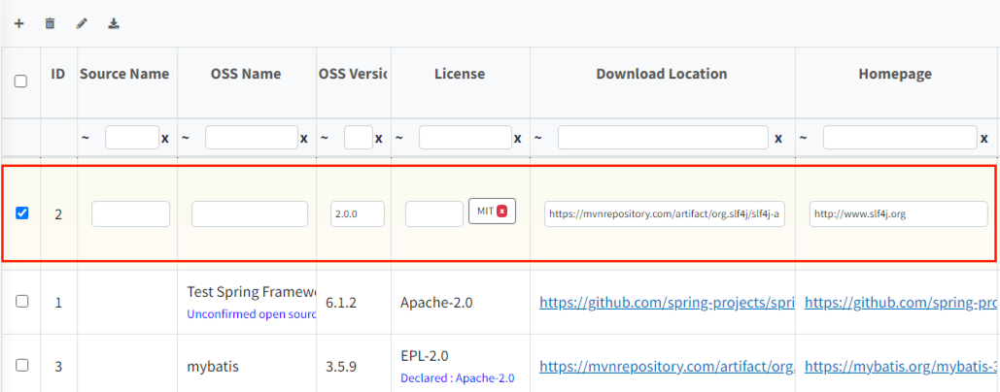
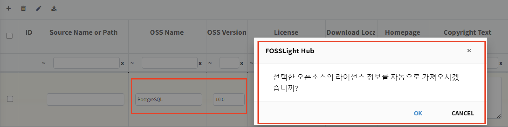
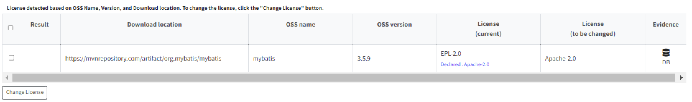

# Common

## OSS Table 활용법
### OSS Table 상단 버튼
OSS Table 우측 상단에는 4가지 버튼이 있습니다.
  
- : row가 추가됩니다.
- : 선택된 row 삭제됩니다. 선택된 row가 없이 클릭하는 경우, 전체 삭제됩니다.
- : Bulk Edit 기능으로, 선택된 row에 전체에 대해 동일한 내용으로 업데이트할 수 있습니다. Bulk Edit 클릭 시 아래와 같은 팝업을 확인할 수 있습니다.
  - 수정을 원하는 항목을 선택한 후, 수정하고자 하는 내용을 작성하고 Change를 눌러줍니다.
    {: width="80%"}
- : OSS Table 내용을 선택한 형식으로 Export 합니다.
  - BOM export의 경우 Report 형태 및 SBOM 관리를 위한 여러 형식으로 출력 가능합니다. 
    {: width="30%"}
  - Project에서 다른 BOM을 제외한 다른 탭들의 경우 FOSSLight Report가 출력됩니다. 
    {: width="30%"}
     
### OSS Table Cell 수정
OSS Table에서 수정하고 싶은 내용이 있을 경우, 수정하고자 하는 row를 더블 클릭 하면 입력 가능한 상태로 전환됩니다.

### OSS 정보 자동 완성
시스템에 등록되어 있는 Open Source의 경우, OSS Name과 OSS Version을 통해 저장된 정보를 자동으로 불러올 수 있습니다.
- OSS Name, OSS Version을 입력합니다.
- Version 입력 후, 자동 완성 여부를 묻는 팝업을 확인할 수 있습니다. 팝업에서 OK를 누르면 자동 완성이 됩니다.

### OSS Table Search
Header Column 아래 Filter Row가 위치하고 있습니다. 이 Filter Row를 활용하여 원하는 값을 검색할 수 있습니다.

- Filter Row는 다음과 같이 구성됩니다:
  - 검색조건:

    | **문자**                                             | ~        | ==    | !         | ^          | !^                  | !        | !@                | !~               |
    |----------------------------------------------------|----------|-------|-----------|------------|---------------------|----------|-------------------|------------------|
    | **설명**   &nbsp;&nbsp;&nbsp;&nbsp;&nbsp;&nbsp;&nbsp; | Contains | equal | not equal | begin with | does not begin with | end with | does not end with | does not contain |
  - 검색어 입력란
  - 검색어 입력란 초기화 (x 버튼)

### OSS의 버전별 정보 조회 기능
검색하고 싶은 OSS의 ID를 클릭하면, 해당 OSS의 버전별 정보를 조회할 수 있습니다.

- 참고: Open Source 상세 정보 창 
  {: width="70%"}

## Pre-Review
Pre-Review 버튼을 사용하면 Download Location 기반으로, 시스템에 저장된 Open Source 정보 혹은 License 정보를 불러올 수 있습니다.

### License 확인 방법
1. Pre-Review > License를 클릭합니다.
2. 'License (to be changed)'의 License로 변경하고 싶은 Row를 선택합니다.
3. 'Change License'를 클릭 합니다. 변경된 License가 OSS Table에 반영됩니다.

### OpenSource 확인 방법
1. Pre-Review > Open Source 를 클릭합니다.
2. 'Registered OSS Name (to be changed)'의 값으로 변경하고자 하는 Row를 선택합니다.
3. 'Change OSS Name'을 클릭합니다. 변경된 Open Source 이름이 OSS Table에 반영됩니다.

**세부 기능**
- 작성한 Download location이 redirect되는 경우, redirect url 기준으로 추천된 OSS Name(Registered OSS Name)가 생성되고,
  하단에 redirect url 정보를 확인할 수 있습니다.
- 접속 할 수 없는 download location의 경우에는 'Registered OSS name(to be changed)'에 
  Invalid download location. warning message가 함께 출력됩니다.
- 추천된 OSS Name을 클릭하면 해당 OSS 상세 정보를 확인할 수 있습니다.
- 회색 Row로 표시된 경우는 동일한 Download location으로 검색된 OSS 가 2개 이상인 경우입니다.
  이에 대하여 Registered OSS Name의 cell을 클릭하여 OSS Name을 선택할 수 있습니다.
- 'Change OSS Name', 'Change License'를 눌러 변경된 사항은 OSS Table에 바로 반영되고, 
  'Comment'에 기록됩니다. 'Comment'를 통해 변경 history를 확인하실 수 있습니다.

## Share URL
프로젝트 정보를 공유하기위해 Share URL 기능을 사용할 수 있습니다.
View 권한이 없을 경우에도 Share URL을 이용하면 해당 항목의 개요를 확인할 수 있으나,
공유를 목적으로 하는 기능이기 때문에 정보 수정은 제한됩니다. (단, 로그인 필요)
- Project: Project > Project Information에서 Share 버튼을 클릭
  
- 3rd Party: 공유하고자 하는 항목에서 Share 버튼을 클릭
  
- Self-Check: 공유하고자 하는 항목에서 Share 버튼을 클릭

## Project / 3rd Party 목록
Project 및 3rd Party 메뉴에 진입하면 각 목록을 확인할 수 있습니다.
이 화면에서는 아래 기능을 공통으로 지원합니다.

### 프로젝트 검색 결과 Export
### Division 변경
### Watcher 변경
