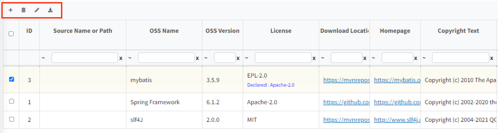
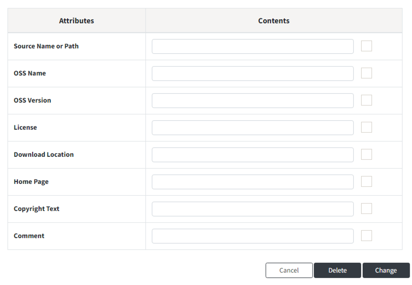
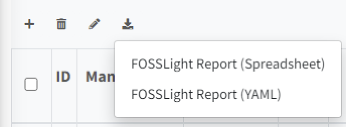

# OSS Table 상단 버튼
OSS Table 좌측 상단에는 4가지 버튼이 있습니다.
  
- {: width="1%"} : row가 추가됩니다.
- {: width="1%"} : 선택된 row 삭제됩니다. 선택된 row가 없이 클릭하는 경우, 전체 삭제됩니다.
- {: width="1%"} : Bulk Edit 기능으로, 선택된 row에 전체에 대해 동일한 내용으로 업데이트할 수 있습니다. Bulk Edit 클릭 시 아래와 같은 팝업을 확인할 수 있습니다.
  - 수정을 원하는 항목을 선택한 후, 수정하고자 하는 내용을 작성하고 Change를 눌러줍니다.
    {: width="80%"}
- {: width="1%"} : OSS Table 내용을 선택한 형식으로 Export 합니다.
  - BOM export의 경우 Report 형태 및 SBOM 관리를 위한 여러 형식으로 출력 가능합니다. 
    {: width="30%"}
  - Project에서 다른 BOM을 제외한 다른 탭들의 경우 FOSSLight Report가 출력됩니다. 
    {: width="30%"}
