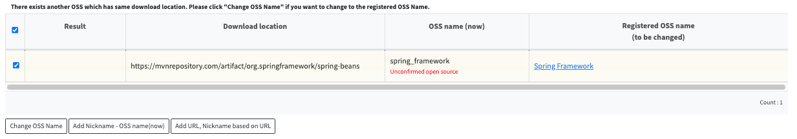

# (Admin Only) Open Source 정보 변경 하기

> **Note**
>
> 'Add Nickname- OSS name(now)' 와 'Add URL, Nickname based on URL' 버튼은 Admin에게만 보이는 버튼입니다.
> 
> 'Registered OSS name (to be changed)'에 적힌 오픈소스 정보를 수정할 수 있습니다.
> 단, 'Registered OSS name (to be changed)'이 DB에 등록되어 있는 경우에만 가능하고, 이미 저장되어 있는 정보에 대해서는 추가하지 않습니다.
 

## Open Source에 Nicnkname 혹은 Nickname과 URL 추가하기
1. Pre-Review > Open Source 를 클릭합니다.
2. Open Source 정보를 수정하고자 하는 row를 선택합니다. 
   수정 되는 대상 Open Source 는 'Registered OSS Name (to be changed)' 컬럼에 적힌 Open Source 입니다.  
3. **'Add Nickname - OSS name(now)'** 을 클릭합니다.
   'OSS name(now)'의 값이 선택한 Open Source의 Nickname으로 추가됩니다.
   Nick name과 URL을 동시에 추가하고 싶은 경우라면, **'Add URL, Nickname based on URL'** 버튼을 클릭합니다.

**Pre-Review 테이블 세부 기능**
- 작성한 Download location이 redirect 되는 경우, redirect URL 기준으로 추천된 OSS Name(Registered OSS Name)이 생성되고,
  하단에 redirect url 정보를 확인할 수 있습니다.
- 접속할 수 없는 download location의 경우에는 'Registered OSS name(to be changed)'에 
  Invalid download location. warning message가 함께 출력됩니다.
- 추천된 OSS Name을 클릭하면 해당 OSS 상세 정보를 확인할 수 있습니다.
- 회색 Row로 표시된 경우는 동일한 Download location으로 검색된 OSS 가 2개 이상인 경우입니다.
  이에 대하여 Registered OSS Name의 cell을 클릭하면 변경하고자 하는 OSS Name을 선택할 수 있습니다.
- 'Change OSS Name', 'Change License'를 눌러 변경된 사항은 OSS Table에 바로 반영되고, 
  'Comment'에 기록됩니다. 'Comment'를 통해 변경 history를 확인하실 수 있습니다.

  