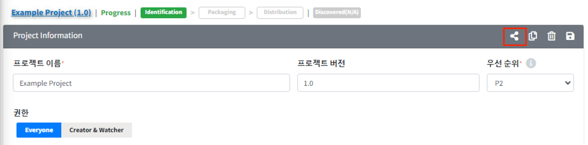

# 정보 공유 버튼 (Share URL)
{: width="1.5%"}
버튼을 이용하여 현재 아이템의 정보를 공유할 수 있습니다.
View 권한이 없을 때, Share URL을 이용하면 해당 항목의 개요를 확인할 수 있습니다.
다만 공유를 목적으로 하는 기능이므로 정보 수정이 되지 않는 View 화면으로 보입니다.
수정 권한이 있는 경우라면, 수정 가능한 화면으로 보이게 됩니다.
로그인을 해야 share url로 공유받은 화면을 확인할 수 있습니다.

**공유 예시**
1. Project > Project Information에서 Share 버튼을 클릭
  {: width="80%"}
2. 공유된 화면을 확인할 수 있습니다. 수정 권한이 있는 경우, 수정 가능한 화면으로 보이게 됩니다.
  {: width="80%"}
