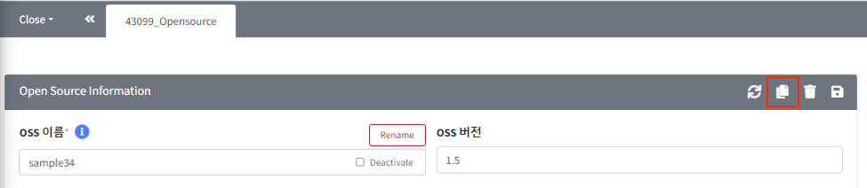

# 복사 버튼
{: width="1.5%"}을 이용하여 현재 아이템을 복사합니다. 
복사 버튼을 누르면, 기존 아이템의 내용이 복사된 채로 새탭이 생성됩니다.
원하는 세부 내용을 수정한 후 저장하면 복사한 내용이 저장됩니다.

**복사 예시**
1. Open Source 상세화면에서 Copy 버튼을 클릭합니다.
   {: width="80%"}
2. Open Source 가 복사되면서 복사된 내용으로 채워진 copy_[Open_Source_id]_Opensource 탭을 확인할 수 있습니다.
   {: width="80%"}
3. 수정하고자 하는 내용으로 업데이트한 후 저장 버튼을 클릭합니다.

> **Note**
> 
> Project는 복사 할 때, Process 단계에 맞춰 복사 할 수 있습니다: 
> [Project 복사 Tip](../../2_project/3_reuse_project/1_copy_project.md#프로젝트-재사용하기-프로젝트-복사)

