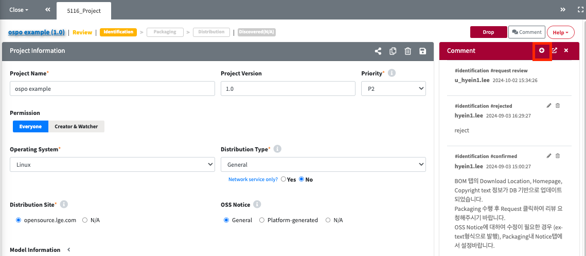
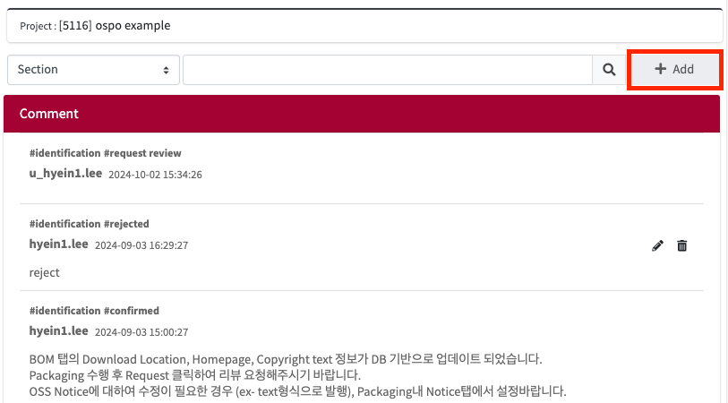

# Comment 추가 하기

## Comment View
 버튼을 눌러 Comment를 추가할 수 있습니다.

## Comment Window
별도의 창으로 분리해서 Comment를 보는 경우 '+Add'버튼을 눌러 Comment를 추가할 수 있습니다.

## Comment 작성 팝업 

1. Comment 를 남길 수 있는 팝업이 나옵니다.
2. 원하는 Comment를 작성한 후 'Save & Send Comment'를 클릭합니다.
3. 임시로 Comment를 저장하고 싶은 경우라면 'Save Draft'를 클릭합니다. 
   다시 Add 버튼을 눌러 comment 작성 팝업을 확ㅇ니하면, 이전에 작성하던 Comment가 남아있습니다.