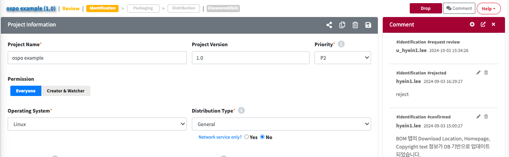
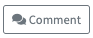

# Comment

License, Open Source, Project, 3rd Party의 상세화면에 들어가면 우측에 히스토리 관리를 위한 Comment View를 확인할 수 있습니다.
Comment를 활용하여 변경 히스토리를 기록하거나, 리뷰어와 사용자간의 커뮤니케이션을 할 수 있습니다.

Comment 에서 사용되는 기본 버튼은 아래와 같습니다:

|                                Button Image                                 | Description |
|:---------------------------------------------------------------------------:| ------------- |
|            | Comment창을 나타내거나 숨길 수 있는 토글 버튼입니다.|
|               | Comment를 추가하기 위한 버튼입니다.|
|    | Comment를 별도의 창으로 분리해서 보기위해 사용하는 버튼입니다.|
|        | Comment View를 닫기위해 사용하는 버튼입니다.|

  


