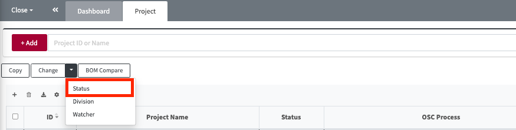

# Division, Watcher, Status 변경

##  Division 변경
'Change' > 'Division' 버튼을 통해, 여러 Project / 3rd party SW에 대해 한번에 Division을 변경할 수 있습니다.
Division 변경은 권한 있는 프로젝트에 대해서만 가능합니다.
- 해당 메뉴: Project, 3rd party

**변경 방법:**
1. 목록에서 변경하고자 하는 프로젝트를 선택한다
2. Change 버튼 클릭 > Division을 클릭한다
3. 변경하고자 하는 Division을 선택하고 OK를 클릭한다.

## Watcher 변경
'Change' > 'Watcher' 버튼을 통해, 여러 Project / 3rd party SW에 대해 한번에 Watcher를 변경할 수 있습니다.
Division 변경은 권한있는 프로젝트에 대해서만 가능합니다.
- 해당 메뉴: Project, 3rd party
  

**변경 방법:**
1. 목록에서 변경하고자 하는 프로젝트를 선택한다
2. Change 버튼 클릭 > Watcher를 클릭한다
3. 변경하고자하는 Watcher 정보를 입력하고 OK를 클릭한다.
 

## Status 변경
> **Note**
>
> Status 변경은 Project 목록에서만 지원합니다.

'Change' > 'Status' 버튼을 통해, 프로젝트의 Status를 변경할 수 있습니다.
Status변경은 한번에 하나의 프로젝트만 지원하며, 권한 있는 프로젝트에 대해서만 가능합니다.
- 해당 메뉴: Project
  

**변경 방법:**
1. 목록에서 변경하고자 하는 프로젝트를 선택한다
2. Change 버튼 클릭 > Status를 클릭한다
3. 변경하고자 하는 Status를 선택하고 OK를 클릭한다.

**변경 가능한 Status 종류:**

Status의 경우 유저 권한 별로 변경할 수 있는 Status 종류가 다릅니다.
- User:
    - 프로젝트를 Drop 혹은 Restart Identification 상태로 변경하고자 할 떄 사용합니다.
- Admin:
    - Drop, RestartIdentification, 그리고 Complete 상태로 변경할 수 있습니다.

