# Project
> **Info**
>
> Project 메뉴의 기능들에 대한 Tip 입니다.

## 상단 Status bar
프로젝트 상단 Status bar를 통해 현재 프로젝트의 상태 확인 및 각 단계로 이동을 쉽게 할 수 있습니다.
> **Note**
>
> Distribution은 LGE only 기능입니다.

- 프로젝트의 상태를 확인할 수 있습니다. 몇가지 예를들면 아래와 같습니다.
  - Progress (Distribution):  
    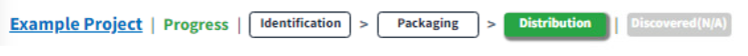{: width="60%"}
  - Request (Identification): 
    {: width="60%"}
  - Review (Packaging): 
    {: width="60%"}
  - FinalReview: 
    {: width="60%"}
  - Complete: 
    {: width="60%"}
- 버튼 클릭 시 각 단계 화면으로 이동할 수 있습니다.
  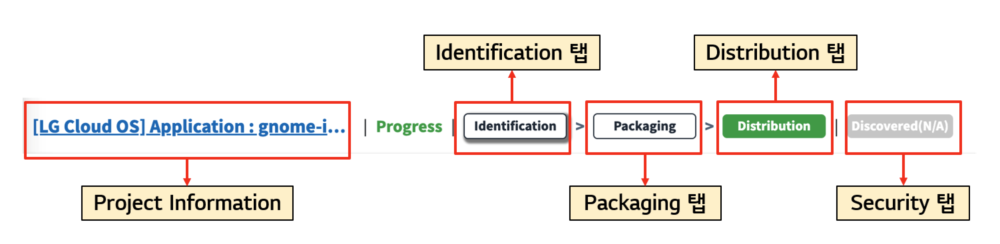{: width="80%"}

## 프로젝트 간 BOM 비교 (Bom Compare)
두 프로젝트의 BOM을 비교하는 기능입니다.
이전 프로젝트 버전과 현재 프로젝트 버전이 어떻게 달라졌는지 확인할 수 있습니다.

**BOM 비교 방법**
1. 프로젝트 목록에서 비교하고자하는 프로젝트를 2개를 선택합니다.
2. BOM Compare 버튼을 클릭합니다.
   {: width="80%"}
3. BOM 목록을 비교하는 탭이 보여집니다. before, after 프로젝트간 차이를 확인할 수 있습니다.
  {: width="80%"}

## 프로젝트 재사용하기 (프로젝트 복사)
프로젝트를 복사하여 이전 분석 내용을 재사용할 수 있습니다.
프로그램 버전을 올리면서 Open Source 목록에 변화가 많지 않은 경우, 
혹은 오픈소스 버전은 동일하지만 패키징 파일을 수정한 경우 등에서 활용할 수 있습니다.

**Copy 방법**
1. 복사하고 싶은 프로젝트를 클릭합니다. 
2. 상단에 Copy 아이콘을 클릭합니다.
3. Project Name 혹은 Version을 수정하고 원하는 정보를 수정한 후 저장해줍니다.
   - Project Name과 Version을 이전과 동일하게 저장할 수는 없습니다.

**복사할 Process 단계 선택하기**

Copy 할 때, 복사할 단계를 선택할 수 있습니다. (OSC Process 단계 참고: [Project 메뉴 가이드](../menu/4_project.md))

- Identification Progress: 사용하는 Open Source가 변경되어 Identification 단계부터 진행이 필요한경우
- Identification Confirm: packaging 파일 변경 또는 고지문 수정이 필요한 경우
- Packaging Confirm: 기존 프로젝트와 변동사항이 없는경우

## 특정 오픈소스가 포함된 프로젝트 검색
Search 조건을 통해 특정 오픈소스가 포함된 프로젝트를 검색할 수 있습니다.
1. Search 창에서 Advanced Search 클릭
   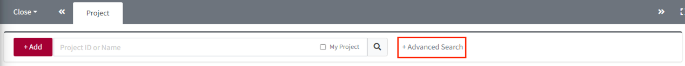
2. 검색하고자 하는 오픈소스 정보를 OSS Name, OSS Version에 입력
   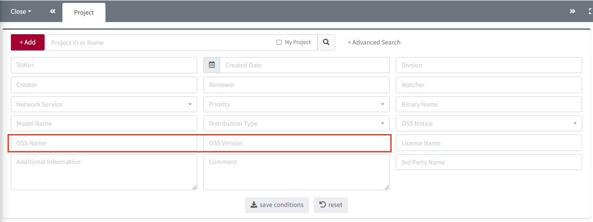
3. Search 버튼 클릭
   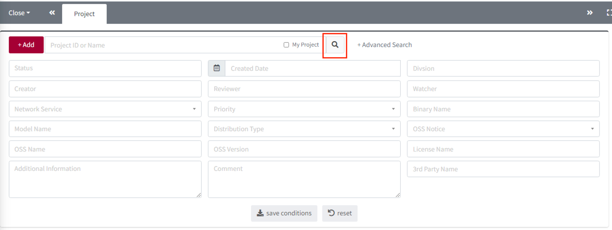
4. 2번에서 입력한 오픈소스를 포함한 프로젝트 목록을 확인할 수 있습니다.

## 오픈소스 고지문 종류와 다운로드 방법
### OSS 고지문이란?
OSS 고지문은 "사용된 Open Source와 각 License를 나열하고, Source code 수령방법 등에 대해 안내하며, 
각 License의 원문 전체를 포함하는 문서" 입니다.

### OSS 고지문 다운로드 방법
Pacakging 단계가 confirm 되면 OSS 고지문을 다운로드 받을 수 있습니다.
단, Project의 Distribution type에 따라 OSS고지문이 발행되지 않을 수 있습니다. (ex. 사내이관, 선행개발 등)

발행된 고지문을 다운받는 방법은 다음과 같습니다. 
- Project 목록의 Download column에서 아이콘
  ({: width="1.5%"})을 클릭합니다.
- 혹은 Share Url을 통해 Project Information을 확인하는 경우, Download 받을 수 있는 파일을 확인할 수 있습니다.
  {: width="60%"}

### OSS 고지문 종류
FOSSLight Hub에서 발급 가능한 OSS 고지문 종류입니다.
- Html
  - 일반적인 OSS 고지문 형식으로 사용한 OSS에 대하여 OSS Name, OSS Version, License, Copyright text, License text, Homepage를 출력합니다.
- Text
  - Html 형식과 contents가 동일하나, 일반 text 파일 형식으로 출력하는 OSS 고지문입니다.
- Simple HTML
  - Html 형식의 OSS Notice와 동일하나, License 원문 대신 License 원문을 확인할 수 있는 링크로 대체된 OSS 고지문입니다. 
- Simple Text
  - Simple HTML과 동일하나 파일 형식이 text인 OSS 고지문입니다.
- SPDX(SpreadSheet)
- SPDX(RDF)
- SPDX(TAG)
- SPDX(JSON)
- SPDX(YAML)
- CycloneDX(JSON)
- CycloneDX(XML)

### 다른 고지문 포맷으로 발급하는 방법
기본 형식인 html 형식 외, 다른 형식의 OSS 고지문 발행이 필요한 경우 Packaging단계의 Notice탭에서 산택하시기 바랍니다.
- Notice 탭에서 선택하는 법:
  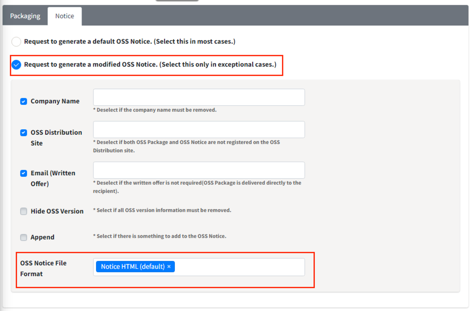

## 다른 프로젝트 분석결과 불러오기 
이전에 분석된 프로젝트 결과를 불러와서 새로운 프로젝트에 적용시킬 수 있습니다.
이 기능은 다음과 같은 경우 유용합니다.
1. 여러 모듈로 나눠져있는 프로젝트가 모듈별로 오픈소스 분석을 수행한 후, 하나로 합쳐서 관리하는 경우
2. 공통 모듈을 활용하는 여러 프로젝트가 있는 경우

- 이전 프로젝트 분석결과를 불러오는 방법: 
  Identification단계의 3rd party, SRC, DEP, BIN탭 모두 각각 Load가 가능합니다. 
  참고로, **Identification 단계가 완료된 프로젝트**만 불러올 수 있습니다.
 
  1. 분석결과를 Load하고자 하는 탭을 클릭합니다.
  2. Project Search 버튼을 클릭합니다.
     {: width="80%"}
    - View 모드로 보여지고 있다면, Edit 버튼({: width="1.5%"})을 누르면
      Project Search 버튼을 확인할 수 있습니다.
  3. 검색 기준을 고르고, 원하는 검색어를 입력합니다.
     {: width="80%"}
  4. 검색 결과 중 불러오고 싶은 프로젝트를 선택합니다. 
     {: width="80%"}
  5. 검색 목록 아래에 Detail Preview 메뉴에 보이고, 로드될 오픈소스 목록을 확인할 수 있습니다. Load 버튼을 누릅니다.
     {: width="80%"}
  6. 팝업에서 원하는 추가 방식을 선택합니다. 
     {: width="80%"}
     - Reset&Load: OSS Table에 입력한 내용을 초기화 한 후, 선택한 프로젝트에 포함된 오픈소스 목록을 불러옵니다.
     - Load&Append: OSS Table에 입력된 내용은 그대로 유지하고, 선택한 프로젝트에 포함된 오픈소스 목록을 추가합니다.

## [LGE Only] Distribution 정보 변경
[LG 오픈소스 사이트](http://opensource.lge.com/)에 배포된 프로젝트의 정보 수정이 필요한 경우 다음과 같이 수정할 수 있습니다.
### Description 수정
1. Distribution 탭으로 이동합니다.
2. Description을 원하는 내용으로 수정 후 
   저장({: width="1.5%"})버튼을 클릭합니다. 
   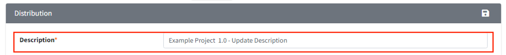{: width="80%"}
3. Distribution Information(To be Updated)화면에 업데이트 되는 정보를 확인한 후 "Distribute" 버튼을 클릭합니다. 
   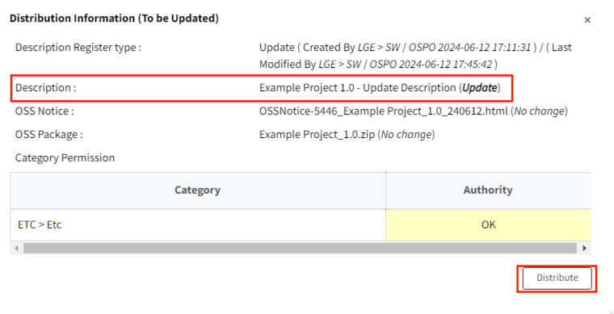

### OSS Package 수정
배포가 완료되었으나 minor 변경이 필요하여 Package 파일을 수정하고 싶은 경우 사용합니다. (ex. README 파일 보완)
1. Distribution 탭으로 이동합니다.
2. 수정하고자 하는 Package File 오른쪽의 'X'버튼을 클릭합니다. 
   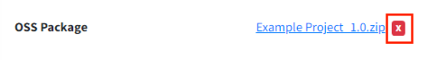
3. Upload 버튼을 클릭하여 변경할 OSS Package 파일을 업로드하고, 'Updated'가 표시되면서 정상적으로 업로드된 것을 확인한 뒤,
   Start to Verify 버튼을 클릭합니다. 
   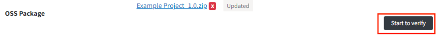{: width="80%"}
4. 정상적으로 verify 성공한 경우, 다음과 같이 Completed로 버튼이 변경되는 것을 확인합니다. 
   {: width="80%"}
   - Verify 실패한 경우 재시도 할 것인지 팝업이 나타납니다. 
   - 계속 실패한다면, 업로드한 파일이 기존 Packaging탭에서 작성한 Path 정보와 일치하는지 다시 확인합니다.
5. Distribution 탭의 저장({: width="1.5%"})버튼을 클릭합니다. 
   Distribution Information(To be Updated)화면에 업데이트 되는 정보를 확인한 후 "Distribute" 버튼을 클릭합니다. 
   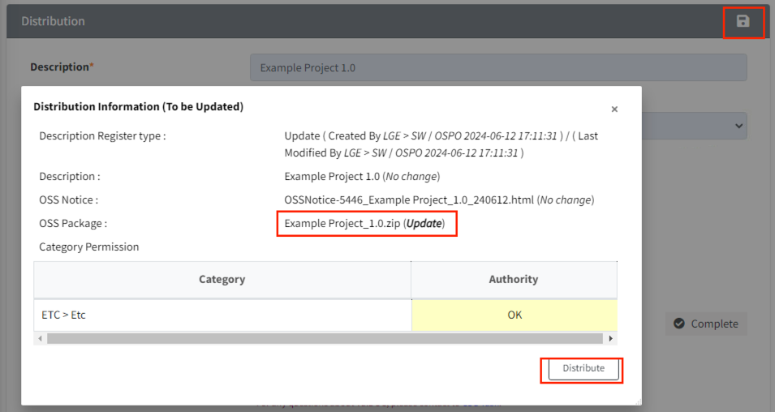{: width="80%"}

### Model Information 수정
1. Distribution 탭으로 이동합니다.
2. Model Information에 추가/삭제 버튼을 이용하여 변경하고자 하는 모델 정보를 입력합니다. 
   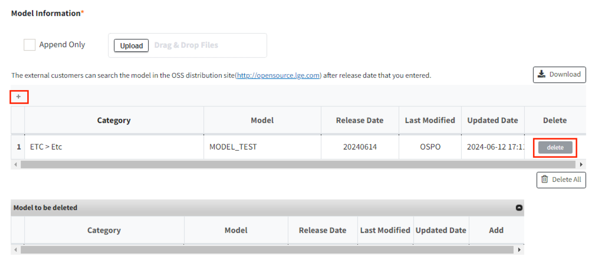{: width="80%"}
3. Distribution 탭의 저장({: width="1.5%"})버튼을 클릭합니다.
   Distribution Information(To be Updated)화면에 업데이트 되는 정보를 확인한 후 "Distribute" 버튼을 클릭합니다. 
   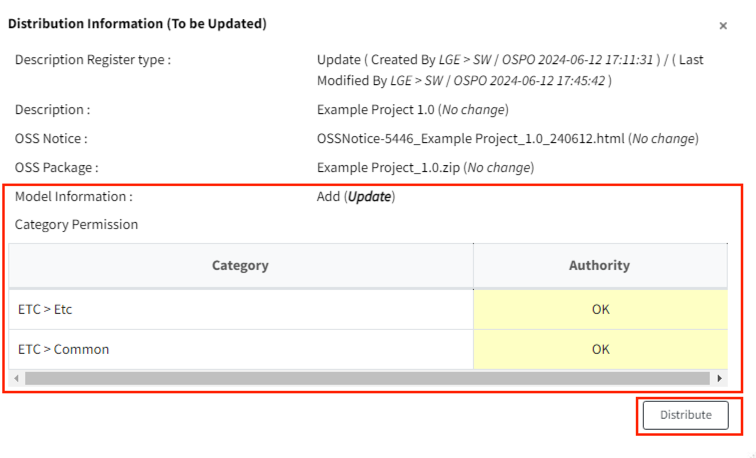{: width="80%"}

### OSS Notice 수정
Notice를 수정하기 위해서는 **Packaging 단계 재수행**이 필요합니다.
1. Project Information에서 "Reopen" 버튼을 클릭합니다.
2. Reopen 팝업에서 "Packaging"을 선택한 후, 신청 사유를 적고 OK를 누릅니다.
   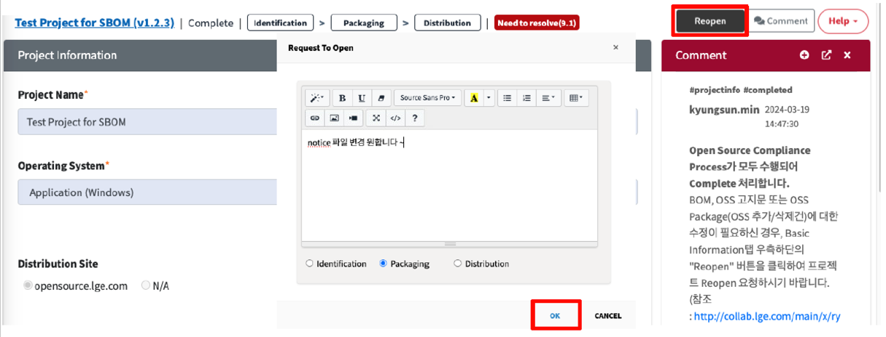
3. Reviewer가 확인 후 Reopen을 승인하면, Packaging 탭에 들어가 변경하려는 정보로 notice를 수정한 후 리뷰요청합니다.
4. Packaging 단계가 완료되면, Distribution을 다시 진행합니다.

### Distribution 취소 

