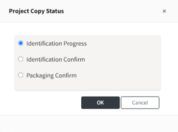

# Project
> **Info**
>
> Project 메뉴의 기능들에 대한 Tip 입니다.
 

## 프로젝트 간 BOM 비교 (Bom Compare)
두 프로젝트의 BOM을 비교하는 기능입니다.
이전 프로젝트 버전과 현재 프로젝트 버전이 어떻게 달라졌는지 확인할 수 있습니다.

**BOM 비교 방법**
1. 프로젝트 목록에서 비교하고자하는 프로젝트를 2개를 선택합니다.
2. BOM Compare 버튼을 클릭합니다.
   {: width="80%"}
3. BOM 목록을 비교하는 탭이 보여집니다. before, after 프로젝트간 차이를 확인할 수 있습니다.
  {: width="80%"}

## 프로젝트 재사용하기 (프로젝트 복사)
프로젝트를 복사하여 이전 분석 내용을 재사용할 수 있습니다.
프로그램 버전을 올리면서 Open Source 목록에 변화가 많지 않은 경우, 
혹은 오픈소스 버전은 동일하지만 패키징 파일을 수정한 경우 등에서 활용할 수 있습니다.

**Copy 방법**
1. 복사하고 싶은 프로젝트를 클릭합니다. 
2. 상단에 Copy 아이콘을 클릭합니다.
3. Project Name 혹은 Version을 수정하고 원하는 정보를 수정한 후 저장해줍니다.
   - Project Name과 Version을 이전과 동일하게 저장할 수는 없습니다.

**복사할 Process 단계 선택하기**

Copy 할 때, 복사할 단계를 선택할 수 있습니다. (OSC Process 단계 참고:[Project 메뉴 가이드](./menu/4_project.md))
{: width="80%"}
- Identification Progress: 사용하는 Open Source가 변경되어 Identification 단계부터 진행이 필요한경우
- Identification Confirm: packaging 파일 변경 또는 고지문 수정이 필요한 경우
- Packaging Confirm: 기존 프로젝트와 변동사항이 없는경우

## 특정 오픈소스가 포함된 프로젝트 검색

## 오픈소스 고지문 종류와 다운로드 방법

## 상단 Status bar

## 다른 프로젝트 분석결과 불러오기
 

## [LGE Only] Distribution 정보 변경