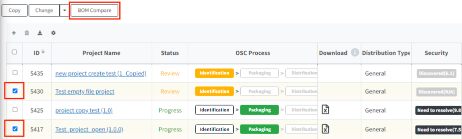

# 프로젝트 간 BOM 비교 (Bom Compare)
두 프로젝트의 BOM을 비교하는 기능입니다.
이전 프로젝트 버전과 현재 프로젝트 버전이 어떻게 달라졌는지 확인할 수 있습니다.

**BOM 비교 방법**
1. 프로젝트 목록에서 비교하고자하는 프로젝트를 2개를 선택합니다.
2. BOM Compare 버튼을 클릭합니다.
   {: width="80%"}
3. BOM 목록을 비교하는 탭이 보여집니다. before, after 프로젝트간 차이를 확인할 수 있습니다.
  {: width="80%"}
