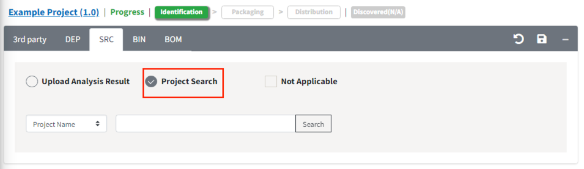
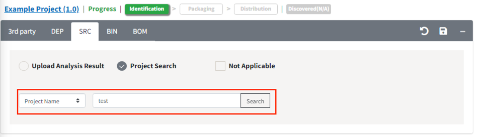
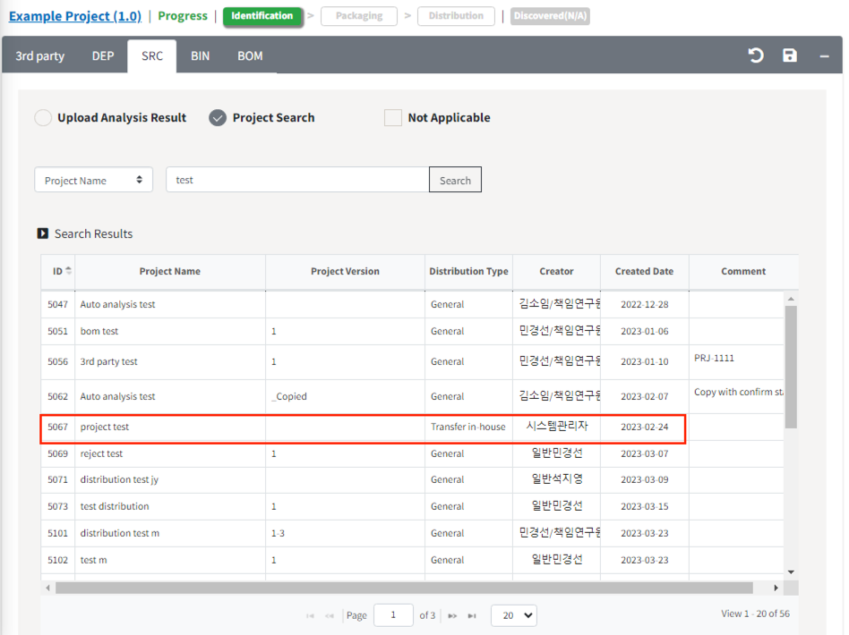
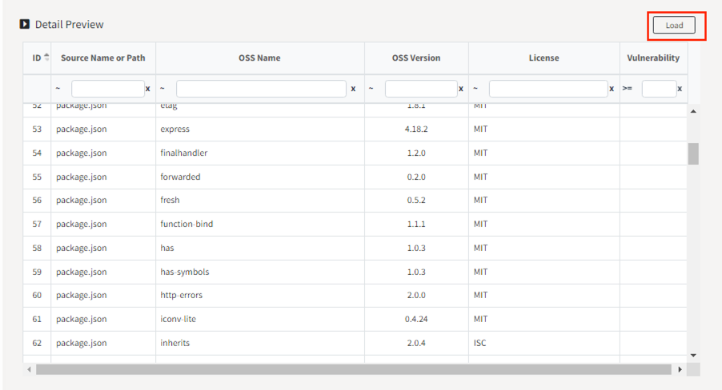
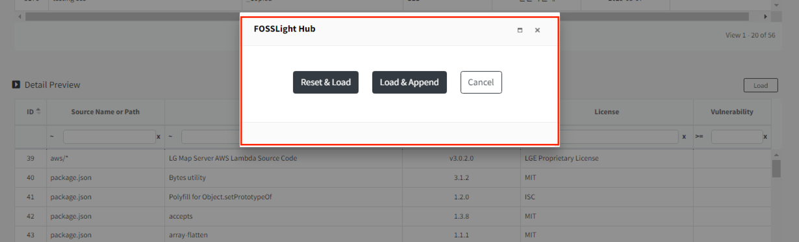

# 다른 프로젝트 분석결과 불러오기 
이전에 분석된 프로젝트 결과를 불러와서 새로운 프로젝트에 적용시킬 수 있습니다.
이 기능은 다음과 같은 경우 유용합니다.
1. 여러 모듈로 나눠져있는 프로젝트가 모듈별로 오픈소스 분석을 수행한 후, 하나로 합쳐서 관리하는 경우
2. 공통 모듈을 활용하는 여러 프로젝트가 있는 경우

- 이전 프로젝트 분석결과를 불러오는 방법: 
  Identification단계의 3rd party, SRC, DEP, BIN탭 모두 각각 Load가 가능합니다. 
  참고로, **Identification 단계가 완료된 프로젝트**만 불러올 수 있습니다.
 
  1. 분석결과를 Load하고자 하는 탭을 클릭합니다.
  2. Project Search 버튼을 클릭합니다.
     {: width="80%"}
    - View 모드로 보여지고 있다면, Edit 버튼({: width="1.5%"})을 누르면
      Project Search 버튼을 확인할 수 있습니다.
  3. 검색 기준을 고르고, 원하는 검색어를 입력합니다.
     {: width="80%"}
  4. 검색 결과 중 불러오고 싶은 프로젝트를 선택합니다. 
     {: width="80%"}
  5. 검색 목록 아래에 Detail Preview 메뉴에 보이고, 로드될 오픈소스 목록을 확인할 수 있습니다. Load 버튼을 누릅니다.
     {: width="80%"}
  6. 팝업에서 원하는 추가 방식을 선택합니다. 
     {: width="80%"}
     - Reset&Load: OSS Table에 입력한 내용을 초기화 한 후, 선택한 프로젝트에 포함된 오픈소스 목록을 불러옵니다.
     - Load&Append: OSS Table에 입력된 내용은 그대로 유지하고, 선택한 프로젝트에 포함된 오픈소스 목록을 추가합니다.
