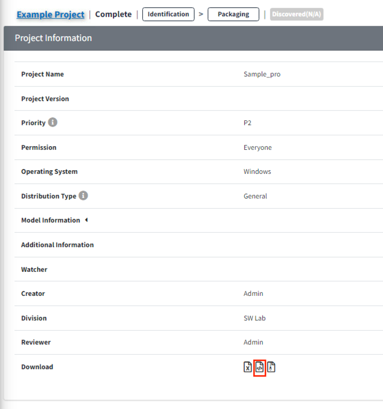

# OSS 고지문 다운로드 방법
Pacakging 단계가 confirm 되면 OSS 고지문을 다운로드 받을 수 있습니다.
단, Project의 Distribution type에 따라 OSS고지문이 발행되지 않을 수 있습니다. (ex. 사내이관, 선행개발 등)

발행된 고지문을 다운받는 방법은 다음과 같습니다. 
- Project 목록의 Download column에서 아이콘
  ({: width="1.5%"})을 클릭합니다.
  {: width="80%"}
- 혹은 Share Url을 통해 Project Information을 확인하는 경우, Download 받을 수 있는 파일을 확인할 수 있습니다.
  {: width="60%"}
