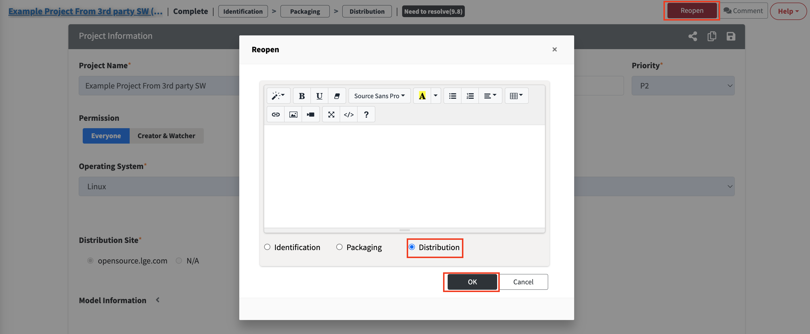

# Distribution 취소
Distribution을 취소하고 싶은 경우 다음과 같이 진행합니다.
1. Complete된 프로젝트의 Project Information에서 "Reopen" 버튼을 클릭합니다.
2. Reopen 팝업에서 "Distribution"을 선택한 후, Reject 사유를 적고 OK를 누릅니다.
   {: width="80%"}
3. Reviewer가 확인 후 Reopen 합니다. Distribution 단계가 취소됩니다.
