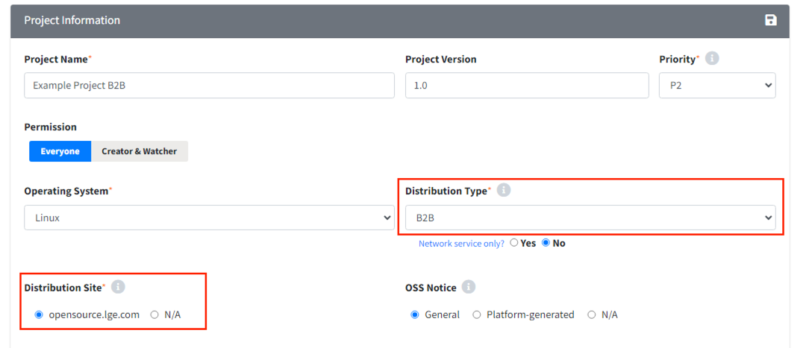
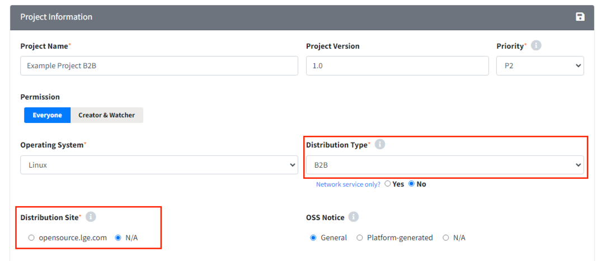
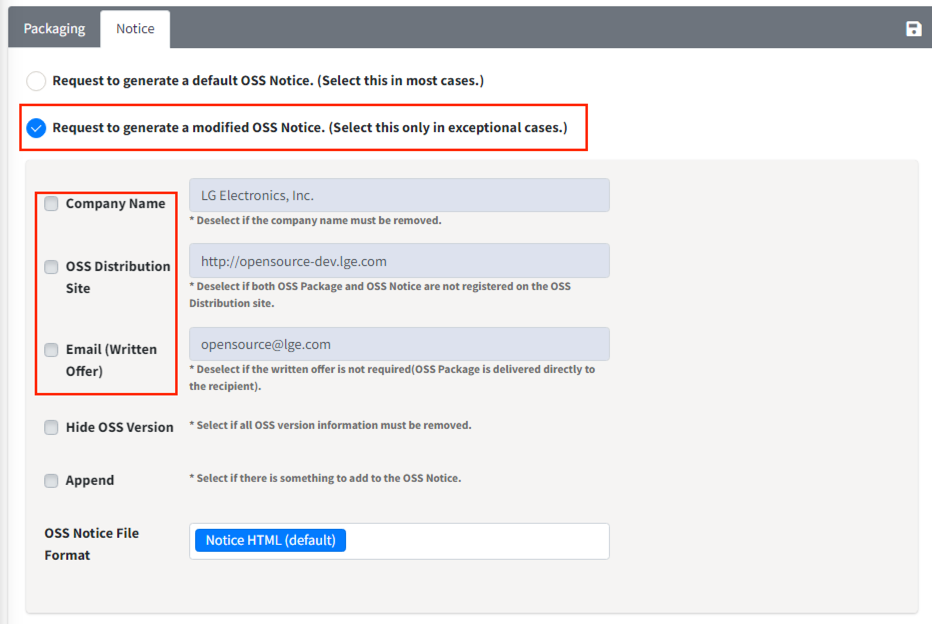

# Use Case
> **Info**
>
> Use case 별 Project 생성 방법을 확인할 수 있습니다.

## 파생 모델 프로젝트
기존 모델과 유사한 소프트웨어를 사용하는 파생 모델에 대해 OSC Process를 진행하는 경우, 
이전 모델에 대해 완료한 [프로젝트를 복사](./2_project.md#프로젝트-재사용하기-프로젝트-복사)하여 진행하면 효율적으로 진행할 수 있습니다.

### 베이스모델에서 몇 개의 오픈소스가 추가로 사용된 경우
- 프로젝트 복사 시, **Identification Progress**를 선택하여 베이스 모델 프로젝트의 오픈소스 목록을 그대로 복사할 수 있습니다.
- 추가된 오픈소스 정보를 Identification 탭에서 입력합니다.

### 새로운 프로젝트 버전이, 기존 프로젝트와 OSS 사용 내역이 동일한 경우
- [BOM Compare](./2_project.md#프로젝트-간-bom-비교-bom-compare)를 활용하면 최종 OSS 목록이 동일한지 확인 가능합니다.
- OSS 사용 내역 및 공개해야 하는 소스코드가 동일한 경우:
  - 기존 프로젝트에 발급된 OSS 고지문을 활용하여 OSC Process 대체가 가능합니다.
- OSS 사용 내역은 동일하나, 공개해야 하는 소스코드가 다른 경우:
  - OSS Package의 README 파일, 혹은 Notice 파일 수정 등과 같이 변경사항이 minor한 경우에 해당합니다.
  - [프로젝트를 복사](./2_project.md#프로젝트-재사용하기-프로젝트-복사) 할 때, **Packaging Confirm** 단계 선택
  - [Distribution 탭에서 OSS package 파일 변경](./2_project.md#oss-package-수정) 후 배포를 진행합니다.

## B2B 모델 프로젝트
B2B 프로젝트 진행 시에는 프로젝트 생성할 때 다음과 같이 진행해야 합니다.
1. Distribution Type을 B2B로 선택합니다.
2. 고객사에서 요구하는 고지문 형태에 따라 Distribution Site를 다르게 선택해야 합니다.

### 고객사에 납품하지만, 자사명으로 제품이 배포되는 경우
고객사에 패키징 파일, 고지문을 전달하고, 고객사의 요청으로 해당 내용을 자사 LG Open Source 사이트에 개시하는 경우입니다.
이러한 경우, 일반적인 프로젝트와 마찬가지로 Distribution 단계까지 진행하여 LG Open Source 사이트에 고지가 되도록 합니다.
프로젝트 생성 시 옵션은 아래와 같이 선택합니다.  
{: width="80%"}
- Distribution Type: B2B
- Distribution Site: opensource.lge.com

### 고객에 고지문 및 패키징 파일을 전달하고, 고객사명으로 제품이 배포되는 경우
고객사 요청으로 LG Open Source 사이트에 패키징 파일, 고지문이 개시되어서는 안되는 경우입니다.
LG Open Source 사이트에 배포하지 않아야 하므로, Distribution 단계는 진행하지 않고 Packaging단계에서 OSC Process를 종료합니다. 
또한, 고지문에 LG전자 명칭, LG Open Source 사이트 명, written offer 메일명 제거가 필요합니다. 
- 프로젝트 생성할 때 옵션:  
{: width="80%"}
  - Distribution Type: B2B
  - Distribution Site: N/A

- Packaging 단계에서 입력할 내용:  
{: width="80%"}
  - Modified OSS Notice 발급 요청 선택합니다.
  - Company Name, OSS Distribution Site, Email(Written Offer) 선택 해제하여 입력되지 않도록 합니다.

## 사내이관 / 선행개발 / 사내사용 프로젝트
사내이관 / 선행개발 / 사내사용의 경우, 배포 및 고지문 발급 없이 OSC Process가 종료됩니다.
공개 의무를 가진 오픈소스가 사용된 경우라면, **Packaging 단계까지 진행**하게 되고,
공개의무를 가진 오픈소스가 사용되지 않았다면 **Identification 단계만 진행**하고 완료됩니다.
{: width="50%"}
- 사내이관: 타 사업부에 사용된 오픈소스 목록 및 패키징 파일을 전달해야 하는 경우로, Distribution Type은 Transfer-in-house를 선택합니다.
- 선행개발: Distribution Type은 Preceding을 선택합니다.
- 사내사용: Distribution Type은 In-house only를 선택합니다.

## Network 서비스로 배포되는 프로젝트
Network Service만 제공하는 프로젝트의 경우, Network 상의 서비스 제공을 배포로 간주하는 License하의 오픈소스가 사용되지 않은 경우,
**Identification 단계까지만 진행**하고 완료됩니다. 다만, Network 상의 서비스 제공을 배포로 간주하는 License가 사용되었다면, 
**Distribution 단계까지 진행**해야 합니다.

Netowkr service 프로젝트의 경우 Distribution Type 옵션을 아래와 같이 선택해줍니다.
{: width="80%"}
- Network service only : Network service only항목을 Yes로 클릭합니다.
- Drop 박스: 현재 프로젝트의 배포 대상에 맞춰 선택합니다.

> **Note**
>
> License 제약사항은 Identification 탭 혹은 License 메뉴에서 검색하여 
> Restriction(Network Triggered)을 확인해보실 수 있습니다. 
> **ex) AGPL-3.0:**  
> {: width="80%"}

## Android / Yocto 플랫폼 프로젝트
> **Note**
>
> Android / Yocto 는 LGE only 기능입니다.

플랫폼에서 자체적으로 고지문을 생성하는 경우, 플랫폼 고지문을 리뷰하기 위한 프로젝트를 생성해야 합니다.
현재 Fosslight Hub에서는 Android와 Yocto를 지원하고 있습니다.
이를 위한 프로젝트를 생성하기 위해서는 Operating System을 OS에 맞게 선택해주시고, OSS Notice를 Platform-generated로 선택합니다.

### Android 모델
{: width="80%"}
- Operating System: Android (platform version) 선택합니다.
- OSS Notice: Platform-generated (Android) 선택합니다.

### Yocto 모델
{: width="80%"}
- Operating System: webOS (platform version) 선택합니다.
- OSS Notice: Platform-generated (Yocto) 선택합니다.
 

## 3rd party 단독 프로젝트
3rd party로 부터 받은 소프트웨어로만 이루어진 프로젝트인 경우에 해당합니다. 
프로젝트에서 3rd party 탭만 로드하여 OSC Process를 진행할 수있습니다.

1. 3rd party 메뉴에서 3rd party SW를 생성하고 리뷰를 완료합니다. (참고: [3rd party SW 생성 가이드](../menu/5_third-party.md))
2. 리뷰 완료된 3rd party SW에서 Create Project for OSS Notice 버튼을 클릭합니다.
{: width="80%"}
3. 프로젝트 정보를 입력하는 창이 뜹니다. 현재 프로젝트에 해당하는 정보로 입력한 후 Save합니다. 
   Additional Information에서 3rd party SW 정보를 가져왔다는 메세지를 확인할 수 있습니다.
{: width="80%"}
4. 새로 생성된 프로젝트의 3rd party 탭을 확인합니다. 
   1번의 3rd party SW가 로드된 상태인 것을 확인할 수 있습니다. 또한 Identification 단계 confirm 된 상태로 프로젝트가 생성됩니다.
{: width="80%"}

