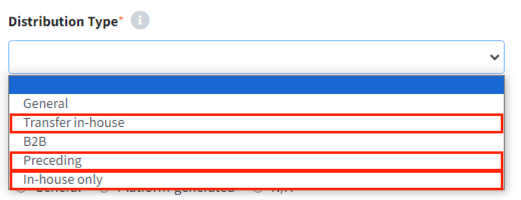

# 사내이관 / 선행개발 / 사내사용 프로젝트
사내이관 / 선행개발 / 사내사용의 경우, 배포 및 고지문 발급 없이 OSC Process가 종료됩니다.
공개 의무를 가진 오픈소스가 사용된 경우라면, **Packaging 단계까지 진행**하게 되고,
공개의무를 가진 오픈소스가 사용되지 않았다면 **Identification 단계만 진행**하고 완료됩니다.
{: width="50%"}
- 사내이관: 타 사업부에 사용된 오픈소스 목록 및 패키징 파일을 전달해야 하는 경우로, Distribution Type은 Transfer-in-house를 선택합니다.
- 선행개발: Distribution Type은 Preceding을 선택합니다.
- 사내사용: Distribution Type은 In-house only를 선택합니다.

