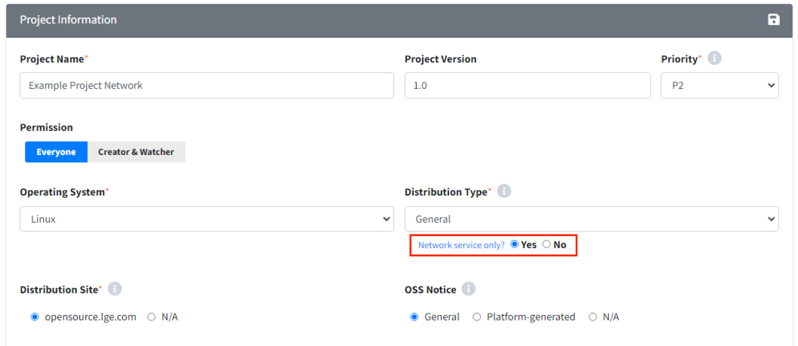
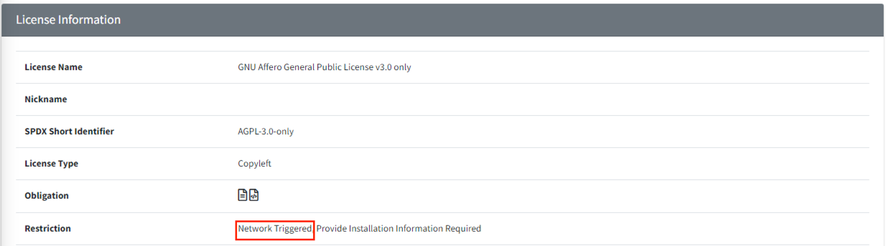

# Network 서비스로 배포되는 프로젝트
Network Service만 제공하는 프로젝트의 경우, Network 상의 서비스 제공을 배포로 간주하는 License하의 오픈소스가 사용되지 않은 경우,
**Identification 단계까지만 진행**하고 완료됩니다. 다만, Network 상의 서비스 제공을 배포로 간주하는 License가 사용되었다면, 
**Distribution 단계까지 진행**해야 합니다.

Netowkr service 프로젝트의 경우 Distribution Type 옵션을 아래와 같이 선택해줍니다.
{: width="80%"}
- Network service only : Network service only항목을 Yes로 클릭합니다.
- Drop 박스: 현재 프로젝트의 배포 대상에 맞춰 선택합니다.

> **Note**
>
> License 제약사항은 Identification 탭 혹은 License 메뉴에서 검색하여 
> Restriction(Network Triggered)을 확인해보실 수 있습니다. 
> **ex) AGPL-3.0:**  
> {: width="80%"}

