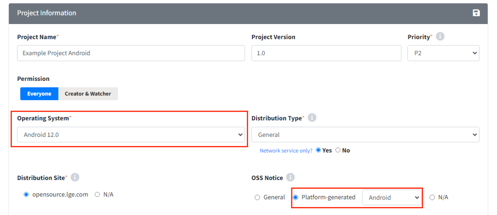
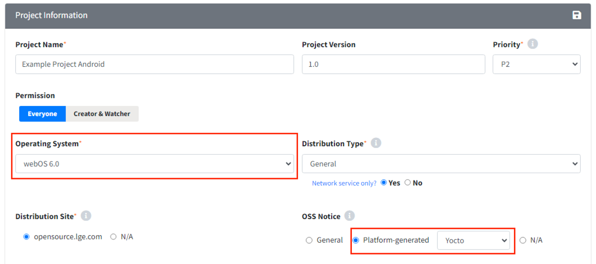

# Android / Yocto 플랫폼 프로젝트
> **Note**
>
> Android / Yocto 는 LGE only 기능입니다.

플랫폼에서 자체적으로 고지문을 생성하는 경우, 플랫폼 고지문을 리뷰하기 위한 프로젝트를 생성해야 합니다.
현재 Fosslight Hub에서는 Android와 Yocto를 지원하고 있습니다.
이를 위한 프로젝트를 생성하기 위해서는 Operating System을 OS에 맞게 선택해주시고, OSS Notice를 Platform-generated로 선택합니다.

## Android 모델
{: width="80%"}
- Operating System: Android (platform version) 선택합니다.
- OSS Notice: Platform-generated (Android) 선택합니다.

## Yocto 모델
{: width="80%"}
- Operating System: webOS (platform version) 선택합니다.
- OSS Notice: Platform-generated (Yocto) 선택합니다.
 
