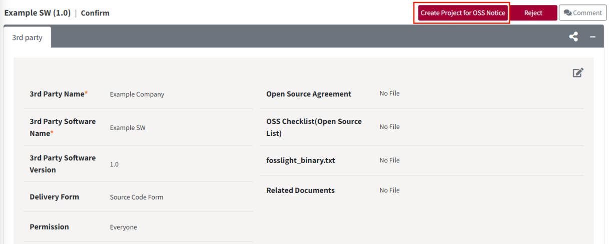
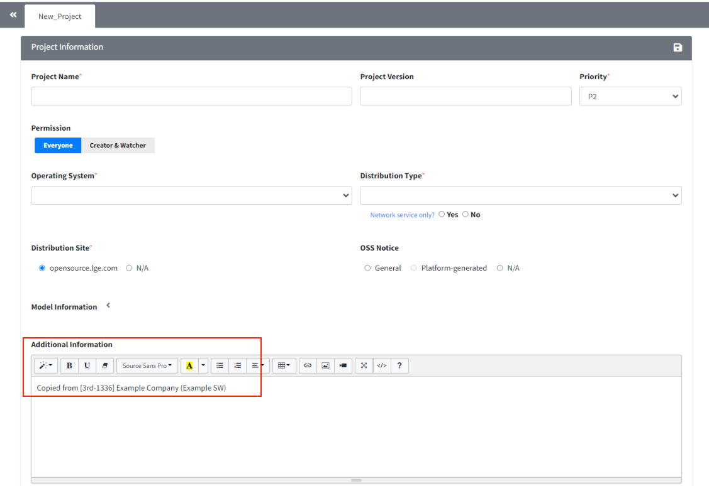
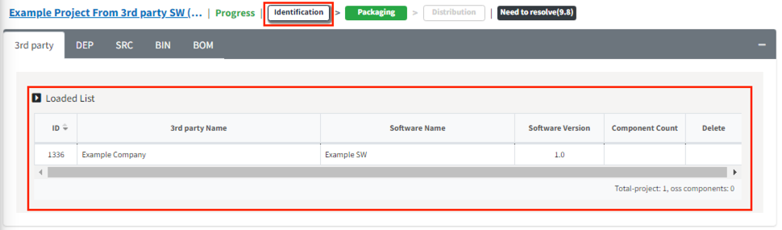

# 3rd party 단독 프로젝트
3rd party로 부터 받은 소프트웨어로만 이루어진 프로젝트인 경우에 해당합니다. 
프로젝트에서 3rd party 탭만 로드하여 OSC Process를 진행할 수있습니다.

1. 3rd party 메뉴에서 3rd party SW를 생성하고 리뷰를 완료합니다. (참고: [3rd party SW 생성 가이드](../../menu/5_third-party.md))
2. 리뷰 완료된 3rd party SW에서 Create Project for OSS Notice 버튼을 클릭합니다.
{: width="80%"}
3. 프로젝트 정보를 입력하는 창이 뜹니다. 현재 프로젝트에 해당하는 정보로 입력한 후 Save합니다. 
   Additional Information에서 3rd party SW 정보를 가져왔다는 메세지를 확인할 수 있습니다.
{: width="80%"}
4. 새로 생성된 프로젝트의 3rd party 탭을 확인합니다. 
   1번의 3rd party SW가 로드된 상태인 것을 확인할 수 있습니다. 또한 Identification 단계 confirm 된 상태로 프로젝트가 생성됩니다.
{: width="80%"}

