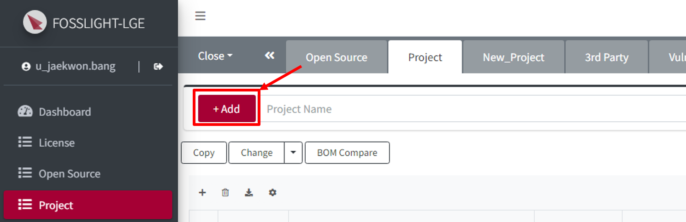
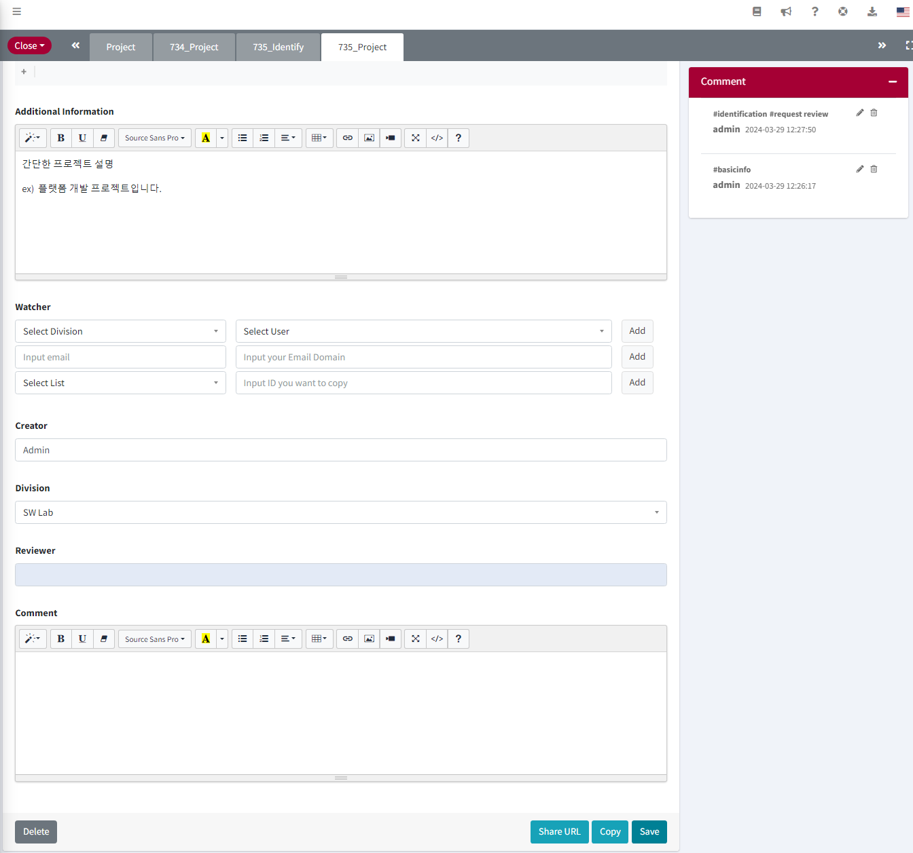
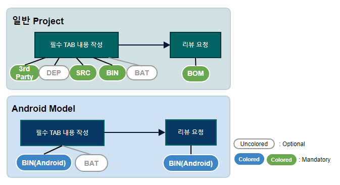
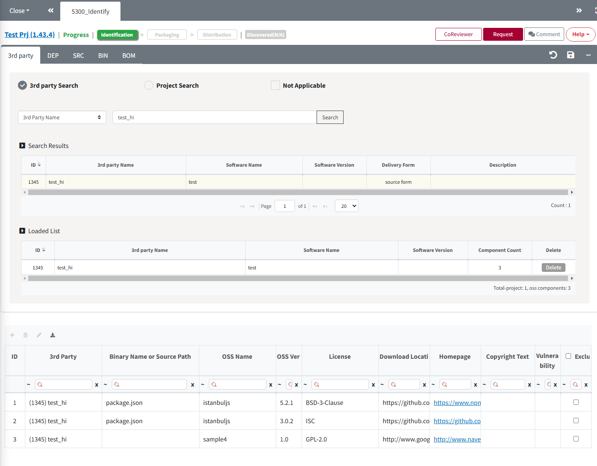
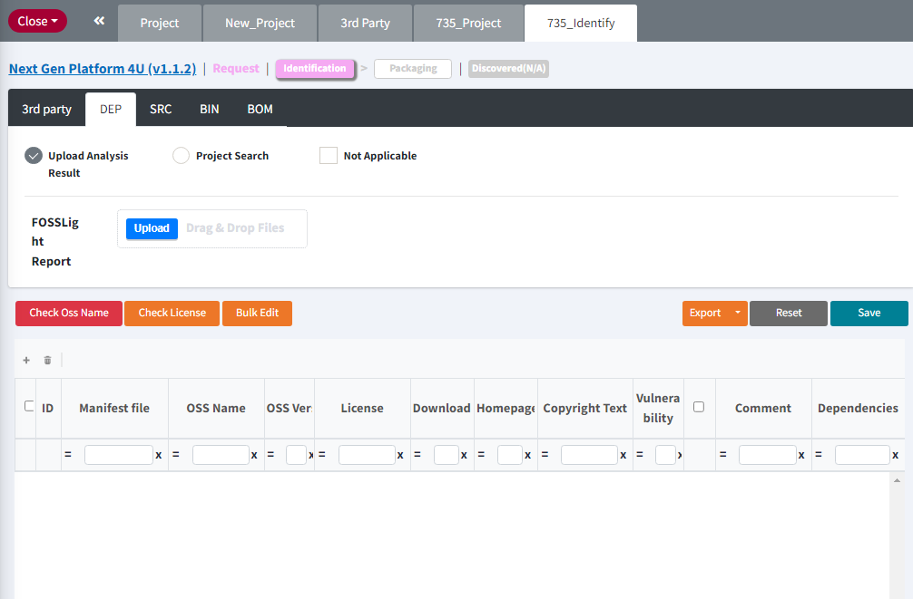
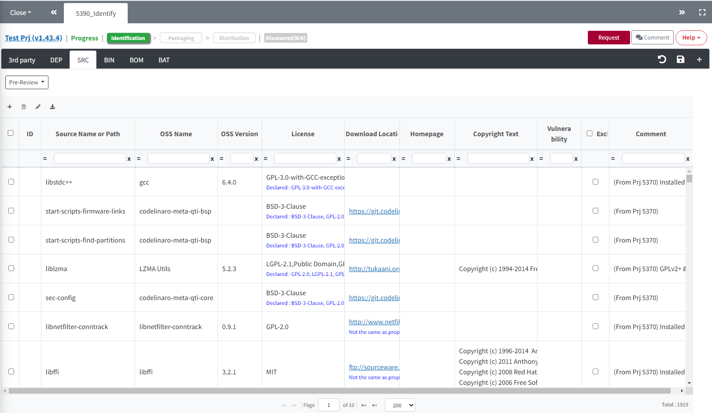
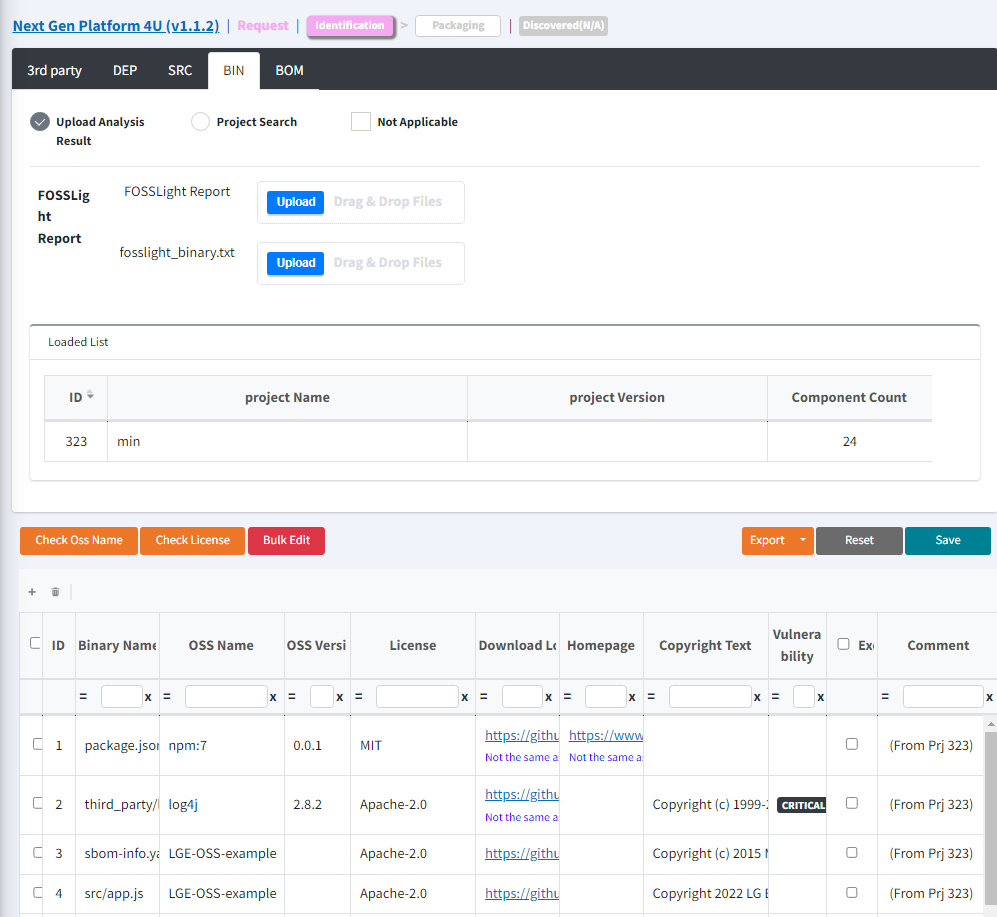
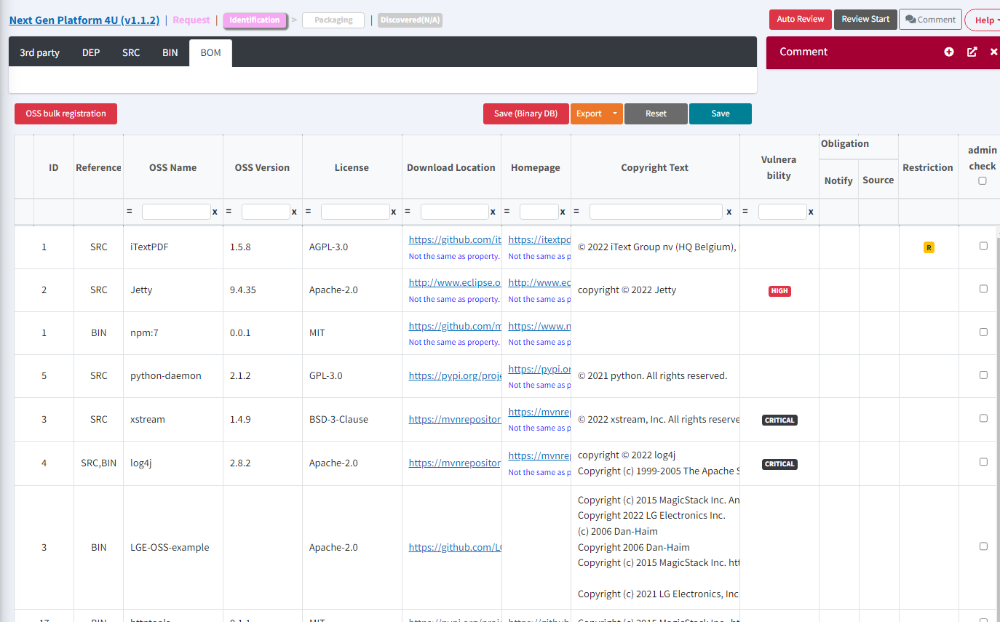
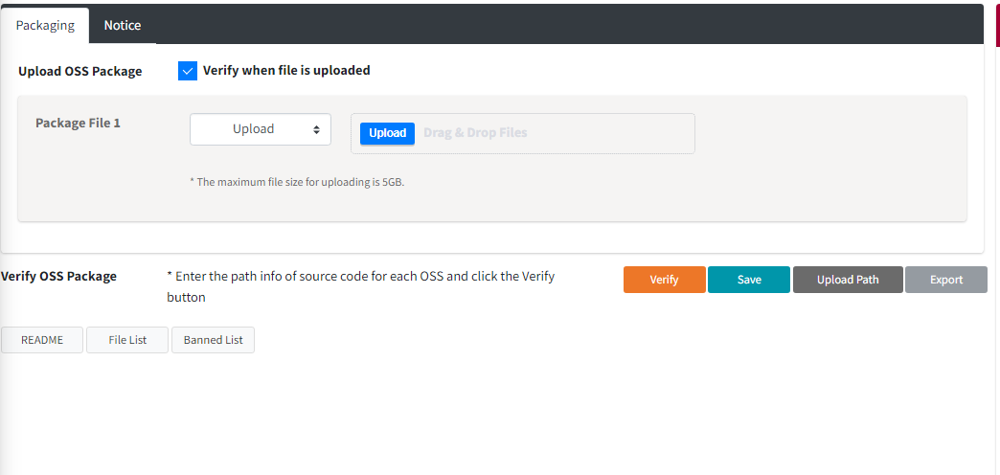

# Project Tutorial
```note
Project를 생성하고 OSC(Open Source Compliance) Process를 수행합니다.
1. Project 생성
2. Identification 작성
3. Packaging 수행
4. OSS Notice 다운로드
```
<iframe width="560" height="315" src="https://www.youtube.com/embed/IUrQyj3s-Ps" title="FOSSLight Hub - 프로젝트 생성" frameborder="0" allow="accelerometer; autoplay; clipboard-write; encrypted-media; gyroscope; picture-in-picture" allowfullscreen></iframe>

## Project의 Process

### 1. Create a Project
**배포하는 Software에 대하여 Project를 생성합니다.**

1. **Project List**에서 **Add** 버튼을 클릭합니다.



2. **New_Project** 탭에서 Project 관련 정보를 입력합니다.


- **Project Name**: Project의 이름을 입력합니다.
    - 모델명과 Project명이 동일할 경우, 모델명을 입력합니다. (Project Name은 영문 작성이 권장됩니다.)
- **Project Version**: Project의 Version을 입력합니다. Version 구분이 없다면 공란으로 둡니다.
- **Permission**: Project의 보기 권한을 설정합니다. Creator와 Watcher에게만 Project 보기 권한을 줄 경우, 'Creator & Watcher'를 선택합니다. (Everyone 체크시 누구나 볼 수 있음.)
Operating System : Operating System을 선택합니다. (선택 가능한 OS가 없을 경우 '직접입력'을 선택하여 직접 입력.)
- **Distribution Type**: Project의 배포 유형을 다음 중 하나로 선택합니다.
    - **General Model**: 일반적인 Model / Software / Application이 배포되는 경우 
    - **Transfer in-house**: 사내 이관하는 경우
    - **B2B**: 타사로 제공하는 경우 
    - **Preceding Software / In-house only**: 선행 개발 또는 사내용 Software로 배포가 예정되지 않은 경우 
- **Network Service only?**: Network Service 형태(ex, Web Service)의 프로젝트인 경우 'Yes' 선택
- **Distribution Site**: OSS 고지문을 등록할 OSS 배포 사이트를 선택합니다. (참고 : LG Open Source 사이트)
    - **[opensource.lge.com](http://opensource.lge.com/)**: 일반적인 경우의 배포사이트
        - <U>Network Service 형태의 프로젝트인 경우에도 "opensource.lge.com"을 선택하시기 바랍니다.</U>
    - **N/A**: 배포사이트에 등록 불가한 특별한 사유가 있는 경우 선택 (ex, 3rd Party에 직접 소스 코드 전달 등)
- **OSS Notice**: OSS Notice 양식을 선택합니다.
    - **General**: 일반적인 고지문 발급이 필요한 경우 
    - **Platform-generated**: Platform에서 자체 생성된 OSS Notice를 제품에 탑재하는 경우, 해당 Platform(ex, Android, Yocto)을 선택
    - **N/A** : 고지문 발급이 필요하지 않는 경우 
- **Priority**: OSS 고지문 발급 요청 우선 순위를 선택합니다.
    - 기본값으로는 P2가 선택되며, 급한 요청 순위에 따라 우선순위(P0 > P1 > P2)를 선택합니다.
    - P0를 자주 선택하는 경우, 해당 조직이 OSC 프로세스 점검 대상이 될 수 있으니 참고하시기 바랍니다.
- **Model Information**: Project에 해당하는 Model 정보 및 양산 일자를 입력합니다.
- **Additional Information**: Compliance에 필요한 부가정보가 있을 경우, 입력합니다.
- **Watcher**: 해당 Project 정보 및 현황을 공유하고자 하는 사용자를 등록합니다. 
    - Watcher로 등록된 사용자는 해당 Project에 대하여 Creator와 동일한 조회, 편집 권한을 가지고, 시스템에서 프로젝트 관련된 메일이 발송됩니다.
    - 단, AD ID로 추가한 계정 중 OSC system에 가입되지 않은 사용자는 최초 OSC System 계정 등록 안내 메일 외 프로젝트 관련 메일이 발송되지 않습니다.
- **Comment** : 해당 Project 관련하여 Comment로 남기고 싶은 사항을 입력합니다.   

3. 우측 상단의 **Save**() 버튼을 클릭합니다.
<br>

#### Basic Information탭
Project에 대한 기본 정보를 수정하거나 Status를 변경하는 탭입니다. 

- **Delete** : Project를 삭제합니다. 
- **Drop** : Project의 Status를 Drop으로 변경합니다. 다시 Process를 진행하기 위해서는 Open 버튼을 클릭해야 합니다. 
- **Copy** : Project를 복사하여 새로운 Project를 생성합니다. 
- **Save** : 기본 정보를 수정한 후에는 클릭해야 저장됩니다. 
- **Open** : Status가 Drop인 경우 표시되며 클릭하면 Status를 Progress로 변경합니다. 
- **Request to Open** : Status가 Complete인 Project인 경우 표시되며 Status를 Progress로 변경하여 Process를 재수행할 수 있습니다. 
- **(Admin Only)**
    - Complete : 모든 Process가 완료된 Project에 대하여 Status를 변경합니다. 
    - Open : Status가 Complete 또는 Drop인 경우 표시되며 Status를 Progress로 변경합니다. 

### 2. Identification
<iframe width="560" height="315" src="https://www.youtube.com/embed/zzopYiY2UOA" title="YouTube video player" frameborder="0" allow="accelerometer; autoplay; clipboard-write; encrypted-media; gyroscope; picture-in-picture" allowfullscreen></iframe>

**배포하는 Project에 대하여 Open Source Software 분석 결과를 작성하고 OSPO의 리뷰를 받습니다.**

#### Identification Process 종류


##### 일반 Project의 Identification Process
- **3rd Party, DEP 탭, SRC, BIN 탭 작성 → BOM 탭**에서 **Request** 버튼을 클릭하여 리뷰 요청
    - **3rd Party**: 해당 Project에 포함된 3rd Party를 load합니다.
    - **DEP**: Dependency 분석 결과를 작성합니다.
    - **SRC**: Source code 분석 결과를 작성합니다.
    - **BIN**: Binary 분석 결과를 작성합니다.
    - **BOM**: 다른 탭에 작성된 OSS List를 취합하고 Warning message를 검토한 후 리뷰 요청을 합니다.

##### Android model의 Identification Process
- **BIN(Android) 탭 작성 → BIN(Android) 탭**에서 **Request** 버튼을 클릭하여 리뷰 요청
    - **BIN(Android)**: Android binary 분석 결과를 작성합니다.

- Project List의 OSC Process 중 Identification() 아이콘을 클릭하여 진입합니다.


#### 2-1. 3rd Party Tab

**3rd Party 탭 작성 Process**
- 3rd Party Software가 포함된 경우: <U>사전에 리뷰 완료된 3rd Party를 Load → Save</U>
- 3rd Party Software가 포함되지 않은 경우: <U>Not Applicable 체크 → Save</U>

**리뷰 완료된 3rd Party를 Load하는 방법**    
하기 방법 중 선택하여 3rd Party Software 정보를 불러올 수 있습니다.     
(💁 3rd Party는 여러개 불러올 수 있습니다.)
- 3rd Party Search
    1. 3rd Party List 메뉴에서 리뷰받은 3rd Party Software를 검색합니다.
    2. 검색된 3rd Party Software 목록에서 불러오기할 3rd Party를 선택합니다.
    3. Load 버튼을 클릭하여, 조회한 3rd Party의 OSS 목록을 추가합니다.
    4. Load한 3rd Party가 Loaded List에 추가됩니다.
    5. 추가한 OSS 목록을 확인합니다.
    6. Save 버튼을 클릭하여 Load된 사항을 저장합니다.
    
    3rd Party List 메뉴에서 Status가 confirm인 3rd Party Software를 검색하고 load합니다.
- Project Search : 다른 Project의 3rd Party 탭을 load합니다.

#### 2-2. DEP Tab

**DEP 탭 작성 Process**
- Package manager를 통해 OSS가 포함된 경우: <U>각 dependency의 OSS 정보를 작성 -> Save</U>
- Package manager를 통해 OSS가 포함되지 않은 경우: <U>Not Applicable 체크 → Save</U>

**각 dependency의 OSS 정보 작성 방법**
- **OSS Table에 수기로 작성**
    - OSS Table의 좌측 상단 + 버튼을 클릭하여 OSS 정보를 기입합니다.
- **OSS 정보 일괄 Load 하는 방법**
    1. Upload Analysis Result 란에 OSS List를 작성한 FOSSLight Report를 업로드합니다. 
        - Load 가능한 FOSSLight Report 양식은 우측 상단 "Export"버튼을 클릭하면 다운로드 가능합니다. 
    2. Project Search : 다른 Project의 DEP 탭을 Load합니다.
- **Scanner를 통해 자동 작성 방법**
    - FOSSLight Dependency Scanner를 통해 자동으로 OSS 정보 기입된 보고서 생성 가능합니다.

#### 2-3. SRC Tab

**SRC 탭 작성 Process**
- Source code별 OSS가 포함된 경우: <U>Source code별 OSS 정보를 작성 -> Save</U>
- Source code별 OSS 분석 대상이 아닌 경우: <U>Not Applicable 체크 → Save</U>

**Source code별 OSS 정보 작성 방법**
- **OSS Table에 수기로 작성**
    - OSS Table의 좌측 상단 + 버튼을 클릭하여 OSS 정보를 기입합니다.
- **OSS 정보 일괄 Load 하는 방법**
    1. Upload Analysis Result 란에 OSS List를 작성한 FOSSLight Report를 업로드합니다. 
        - Load 가능한 FOSSLight Report 양식은 우측 상단 "Export"버튼을 클릭하면 다운로드 가능합니다. 
    2. Project Search : 다른 Project의 SRC 탭을 Load합니다.

#### 2-4. BIN Tab

**BIN 탭 작성 Process**
- Binary가 포함된 경우: <U>Binary별 OSS 정보를 작성 -> Save</U>
- Binary가 포함되지 않는 경우: <U>Not Applicable 체크 → Save</U>

**Binary별 OSS 정보 작성 방법**
- **OSS Table에 수기로 작성**
    - OSS Table의 좌측 상단 + 버튼을 클릭하여 OSS 정보를 기입합니다.
- **OSS 정보 일괄 Load 하는 방법**
    1. Upload Analysis Result 란에 OSS List를 작성한 FOSSLight Report를 업로드합니다. 
        - Load 가능한 FOSSLight Report 양식은 우측 상단 "Export"버튼을 클릭하면 다운로드 가능합니다. 
    2. Project Search : 다른 Project의 BIN 탭을 Load합니다.

#### 2-5. BOM Tab
3rd Party, DEP, SRC, BIN 탭에 작성된 OSS 목록을 취합하고 리뷰 요청을 합니다.


##### Review 요청 방법
1. Merge And Save 버튼을 클릭합니다.
    - 3rd Party, DEP, SRC, BIN 탭에 작성한 OSS List를 취합합니다.
2. [Warning message별 검토 사항](#warning) 검토 사항을 확인합니다.
3. Request Review 버튼을 클릭하여 리뷰 요청을 합니다.
    - 단, 빨간색 Warning Message가 있을 경우 리뷰 요청이 불가합니다.

##### (Admin only) Review 방법
1. BOM 탭 우측 상단 Review Start 버튼을 클릭합니다.
2. [Warning message별 검토 사항](#warning) 검토 사항을 확인합니다.
3. Merge And Save 클릭 후 Confirm을 클릭하면 Packaging 탭이 활성화됩니다. 
    - Creator에게 재확인이 필요한 경우 Reject을 클릭하여 Status를 Progress로 변경합니다.

### 3. Packaging
```note
- Packaging 단계에서는 Source Code 공개 의무가 있는 Open Source를 사용한 경우 공개할 Source Code를 취합(OSS Package)하고 이를 FOSSLight Hub에 등록합니다.
- OSS 고지문은 Packaging 단계가 Confirm되면 자동으로 생성됩니다. 만약, OSS 고지문 내용을 변경해야 할 경우, Notice tab에서 수정할 수 있습니다.
- Project List의 Packaging column 내 버튼을 클릭하여 진입합니다.
```

<iframe width="560" height="315" src="https://www.youtube.com/embed/66uWu4qxOog" title="YouTube video player" frameborder="0" allow="accelerometer; autoplay; clipboard-write; encrypted-media; gyroscope; picture-in-picture" allowfullscreen></iframe>

#### 3-1. Packaging Tab

Packaging tab에서는 OSS Package 파일을 Upload하고 이를 Verify합니다. 
(단, Source Code 공개를 필요로하는 License하의 Open Source를 사용하지 않았다면 이 탭은 비활성화됩니다.)
1. **OSS Package Upload**
    - Source code를 취합한 Packaging 파일(압축 파일)을 Upload합니다.
2. **"Path of source code in the OSS Package" column을 기입합니다.**
    - 공개해야 할 Open Source 종류가 많아 Path 기입을 일일이 하기 어려운 경우, 'Export Path'버튼으로 Packaging OSS List 파일을 다운로드 한 후 Path를 기입하고 'Upload Path'버튼으로 upload 하면 Path 정보가 등록됩니다.
    - 'Save' 버튼으로 입력한 Path정보를 저장할 수 있습니다.
    - Path정보는 대소문자를 구분하니 입력 시 주의하시기 바랍니다.
3. **'Verify'버튼을 클릭하여 확인 과정을 수행합니다.**
    - Verify 후 OSS Package 내에서 찾은 File은 File Count란에 개수가 표시됩니다. 찾지 못한 Open Source가 있다면 "path not found"라고 표시됩니다.
    - OSS Package 내에서 찾은 README, File List, Banned List를 확인할 수 있습니다.
        - **README**: OSS Package 내 포함된 README 파일
        - **File List**: OSS Package 내의 파일 목록
        - **Banned List**: "Proprietary", "Commercial" 등 공개되지 말아야 할 파일 목록


#### 3-2. Notice Tab

**OSS Notice는 Identification > BOM 탭을 기준으로 자동 생성됩니다. 이 때, 발행하는 OSS Notice의 포맷이나 Contents를 수정할 수 있습니다.**

#### 3-3. Review 요청
- Packaging 탭 우측 상단 **Request Review** 버튼을 클릭하여 리뷰 요청을 합니다.

#### 3-4. (Admin only) Review 방법
- Packaging 탭 우측 상단 **Review Start** 버튼을 클릭합니다.
- 우측 상단의 **Confirm**을 클릭하면 Packaging이 Confirm되고 OSC Process가 완료됩니다. 
- Packaging이 Confirm된 Project에 대해서 Project List에서 발행된 OSS Notice를 다운로드 받을 수 있습니다.
    - Creator에게 재확인이 필요한 경우 Reject을 클릭하여 Status를 Progress로 변경합니다.

## ⭐Tips for Project
### Check OSS Name 버튼 (DEP, SRC, BIN Tab)
**OSS Table에 작성된 Download location을 기반으로 FOSSLight Hub에 저장된 OSS Name으로 자동 변경합니다.**
- 팝업에 자동 변환될 OSS 목록이 표시됩니다.
    - Change OSS Name 버튼 : 체크된 Row에 대하여 OSS Table의 OSS Name이 변경됩니다. 
    - **<U>(Admin Only)</U>** Add Nickname 버튼 : 체크된 Row에 대하여 FOSSLight Hub에 저장된 OSS에 Nickname으로 OSS Table에 쓰여진 OSS Name이 추가됩니다.

### <a name="comment"></a> Comment 남기기
- 탭별 우측 상단의 Comment Edit 버튼을 클릭하면 Comment를 남기고 해당 Comment를 Reviewer, Watcher, Creator에게 메일로 발송할 수 있습니다.

### <a name="warning"></a> OSS Table's Warning message 
#### Warning message 색깔별 의미
- <span style="color:red"> 빨간색 </span> : 리뷰 요청 또는 Confirm이 불가합니다. 검토 후 수정이 필요합니다.
- <span style="color:blue"> 파란색 </span> : 리뷰 요청 또는 Confirm 가능하지만, 검토가 필요한 사항입니다.
- <span style="color:grey"> 회색 </span> : 정보 전달을 위한 message입니다.

#### Warning message에 따른 검토 사항

| Message  | Description |
| ------------- | ------------- |
|**This field is required**| 내용 입력이 필요합니다.|
|**Unconfirmed open source**|등록되지 않은 신규 OSS입니다.|
|**Unconfirmed version**|등록되지 않은 신규 버전입니다.|
|**Unconfirmed license**|등록되지 않은 신규 License 입니다.|
|**Dual license: Select a license**|Dual License임에도 모두 사용된 것으로 쓰여져 있습니다. <br>Dual License인 경우, 사용할 License만 선택합니다.|
|**Specify OSS Name or put 1 license in a row**|OSS Name이 - 또는 공란이면서, 여러 License가 하나의 Row에 쓰여져 있습니다.<br> OSS Name이 - 또는 공란인 경우, License별로 Row를 분리하여 작성하여주십시오.|
|**The address should be started with www**|주소 format이 맞지 않습니다.|
|**Formatting error**|줄바꿈 문자가 포함되어 있습니다. 여러 줄 작성이 필요한 경우, Row를 추가하여 작성하시기 바랍니다.|
|**Not the same as property**|입력한 URL이 FOSSLight Hub에 등록된 해당 OSS의 URL과 다릅니다.|

